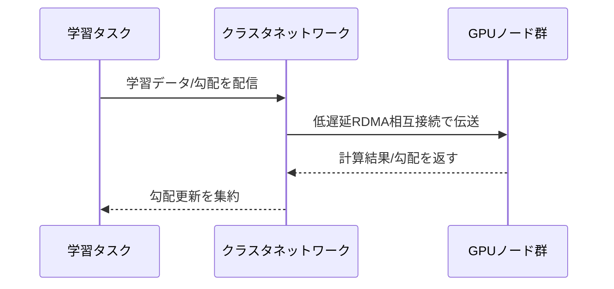

# GPUとHPCコンピュート比較

一言で言うと:大規模AI学習には低遅延クラスタネットワークが必要で、両社ともRDMA/EFA系技術でこの問題を解決している。

## 要点
* AWS:EC2 P/GシリーズGPUインスタンス + EFAネットワーク + UltraCluster、ParallelClusterでHPCクラスタを管理
* OCI:RDMA相互接続のベアメタルGPUクラスタを主力とし、H100/H200/B200を搭載することが多い
* 共通の課題:大規模分散学習ではノード間の通信遅延が学習効率に直接影響する
* 選定のポイント:単体GPUの性能だけでなく、クラスタネットワークアーキテクチャと相互接続帯域も見る必要がある
