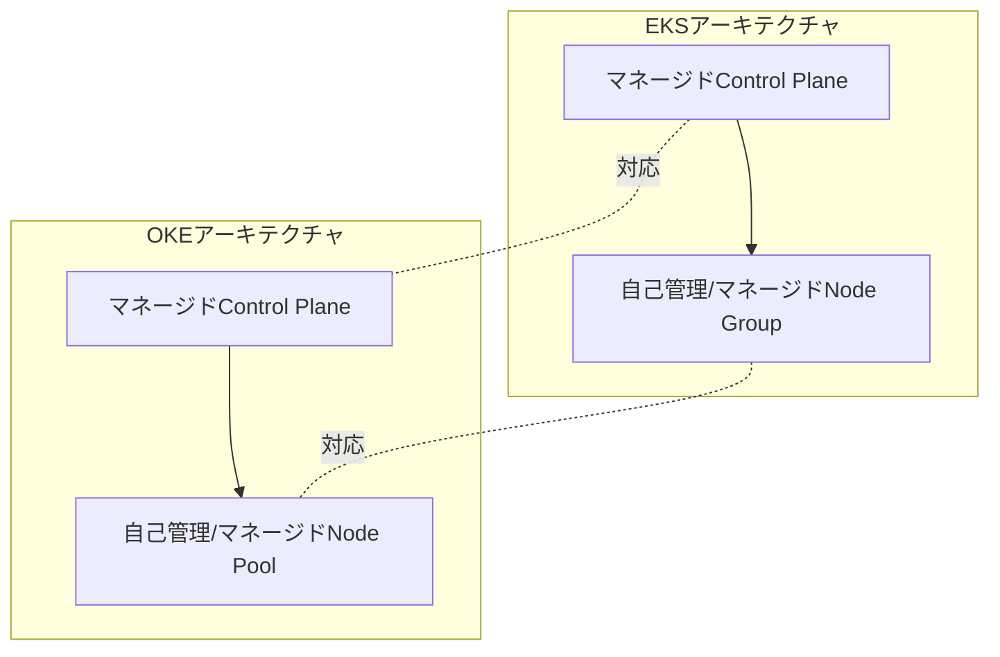

# OKE vs EKS:マネージドKubernetesサービス

一言で言うと:OKEはOCIのマネージドKubernetesサービスで、使用感はEKSと高度に一致している。

## 要点
* 両者とも「マネージドControl Plane + 自分でまたはマネージドのNode Pool」という構造
* OKEのControl Planeは現時点では無料(具体的には公式最新価格ページを確認)
* Node Poolは通常のVM、ベアメタルを選べる他、ArmノードやGPUノードも使用可能
* Kubernetes YAMLとアプリケーションマニフェストの移行は基本的に大きな変更不要。主に変更が必要なのはノードプールとネットワーク設定部分
