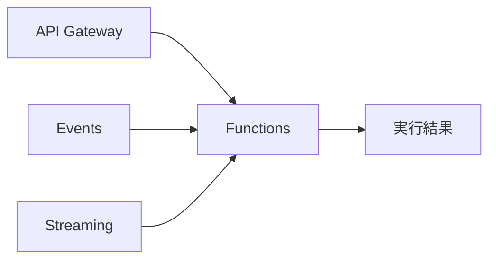

# Functions vs Lambda:サーバーレス関数コンピュート

一言で言うと:OCI Functionsはオープンソースの Fn Project をベースにし、イベント駆動・呼び出し課金という点でLambdaと考え方が一致している。

## 要点
* AWS対応:Lambda
* 基盤はオープンソースのFn Projectで構築されており、理論上一定の移植性がある
* トリガー元:API Gateway、Events(イベント)、Streaming(ストリーム)など、Lambdaのトリガーモデルと類似
* 課金モデル:呼び出し回数と実行時間に基づく課金。コールドスタートなどの特性もLambdaと同様の最適化が必要
