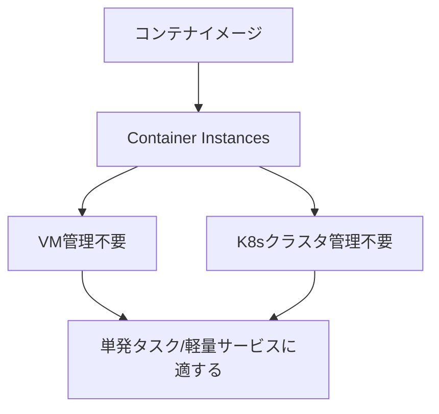

# Container Instances vs Fargate

一言で言うと:基盤の仮想マシンやクラスタを管理する必要なく、単一のコンテナ/タスクを直接実行するサービス。

## 要点
* AWS対応:Fargate
* 適用シナリオ:単一タスク、バッチ処理ジョブ、軽量なAPIサービスを実行する。専用のKubernetesクラスタを立てるまでもない場合
* OKEとの違い:OKEは複雑な複数コンテナのオーケストレーションシナリオ向け、Container Instancesは「コンテナを1つ動かしたいだけ」というシンプルなシナリオ向け
* 課金モデル:コンテナが使用するCPU/メモリリソースと実行時間で課金。Fargateのロジックと一致
