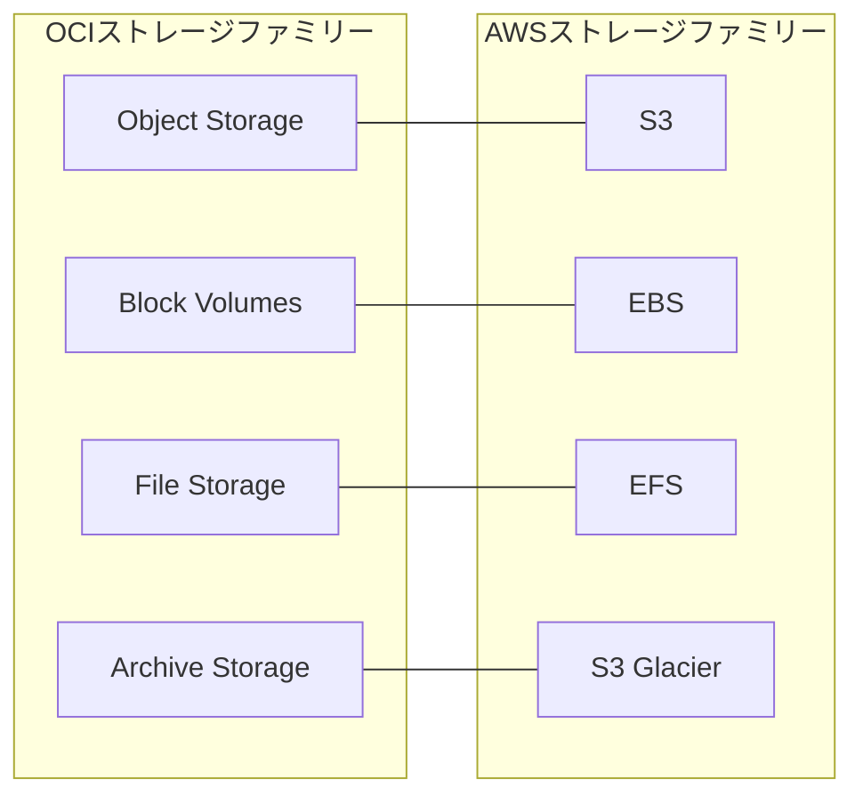

# ストレージ分類の概観

一言で言うと:OCIの4種類のストレージサービスはAWSストレージファミリーのS3、EBS、EFS、Glacierに対応する。

## 要点
* Object Storage:オブジェクトストレージ、S3に対応
* Block Volumes:ブロックストレージ、コンピュートインスタンスにマウントされる、EBSに対応
* File Storage:マネージドNFSファイルシステム、EFSに対応
* Archive Storage:低頻度で長期的なアーカイブ、Glacierに対応
* 公式が強調する差別化の優位点:出口流量(Egress)料金が主要クラウドベンダーより著しく低い
