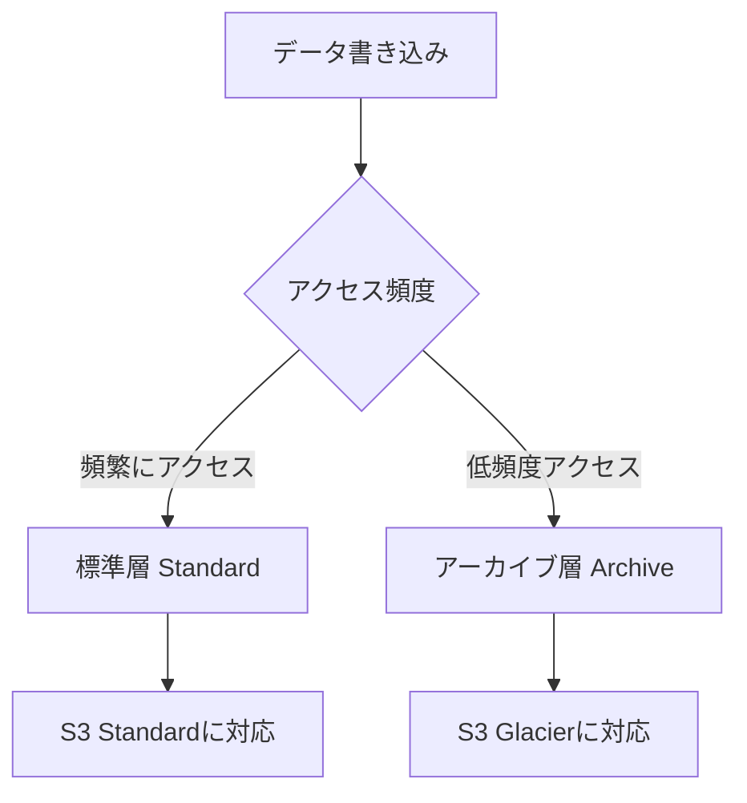

# Object Storage vs S3

一言で言うと:オブジェクトストレージサービス。標準層/アーカイブ層の階層ロジックはS3と似ているが、出口流量料金が主な違い。

## 要点
* AWS対応:S3(標準層)+ S3 Glacier(アーカイブ層)
* ストレージ階層ロジックは類似:ホットデータは標準層、コールドデータはアーカイブ層
* 主な違い:公式によれば出口流量料金がS3よりはるかに安く、大量ダウンロード/オリジンサーバーのシナリオでコスト優位性が明確
* よくある用途:静的サイトホスティング、バックアップ、データレイクの基盤ストレージ、ログアーカイブ
