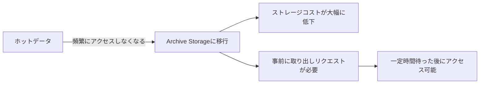

# Archive Storage vs Glacier

一言で言うと:低コストの長期アーカイブストレージ。検索遅延と引き換えにより低いストレージ料金を実現する。

## 要点
* AWS対応:S3 Glacier / Glacier Deep Archive
* コンプライアンス保存、履歴バックアップ、めったにアクセスしないが削除できないデータに適する
* データの取り出しは事前にリクエストを発行し待つ必要があり、標準層のように即座にアクセスできない
* ストレージクラス選択の全体的なロジック:標準層(ホット)→アーカイブ層(コールド)、4種類のストレージサービスは同じホット・コールド階層の考え方を共有している
