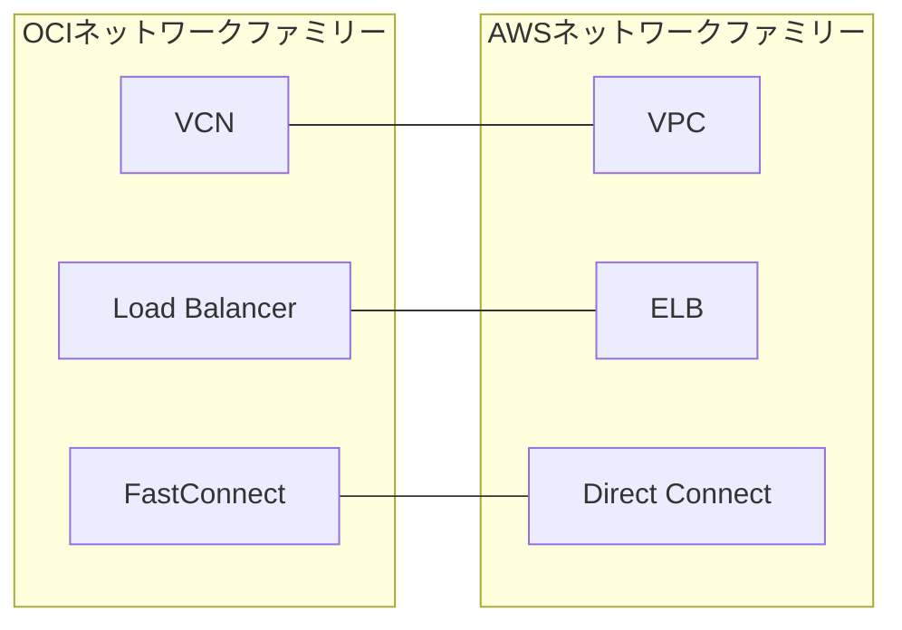

# ネットワーク分類の概観

一言で言うと:ネットワーク分類の3つの核心サービス、VCN、Load Balancer、FastConnectはそれぞれVPC、ELB、Direct Connectに対応する。

## 要点
* VCN(Virtual Cloud Network):VPCに対応、すべての展開の基盤となるネットワーク
* Load Balancer:ELB(ALB/NLB)に対応
* FastConnect:Direct Connectに対応、専用線接続
* ネットワーク分類は前後をつなぐ役割:コンピュートインスタンスはVCN内で動作し、ストレージとデータベースのプライベートアクセスもVCNに依存する
