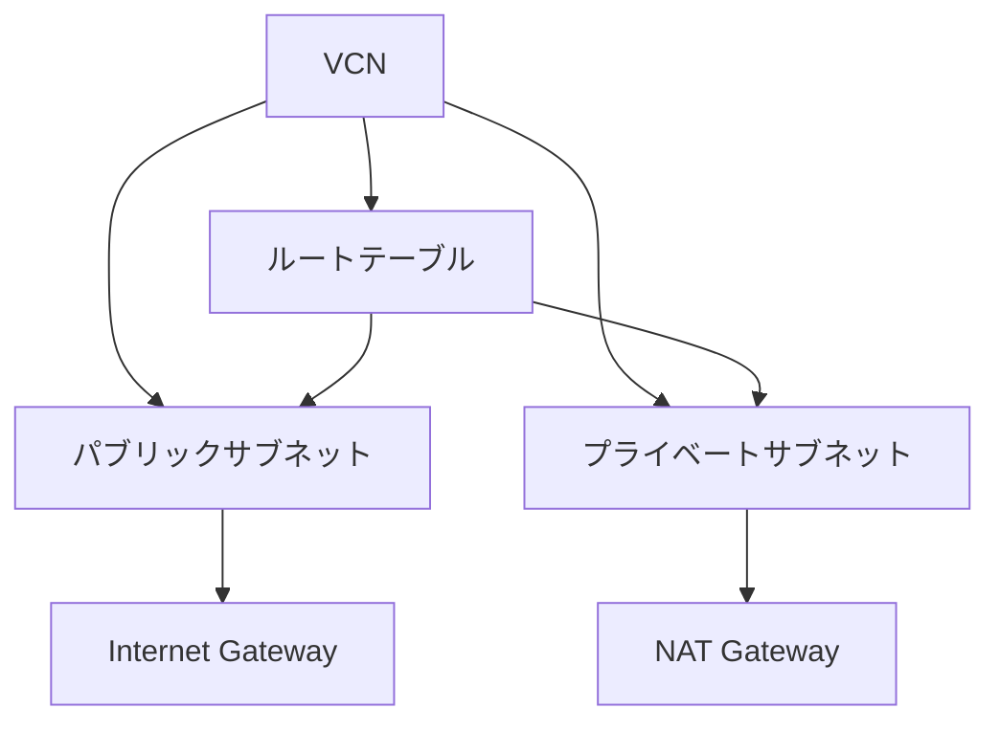

# VCN vs VPC

一言で言うと:VCNはOCIの仮想プライベートネットワーク。サブネット、ルートテーブル、ゲートウェイなどの概念はVPCと基本的に1対1で対応する。

## 要点
* VCN = AWSのVPC、サブネット(Subnet)、ルートテーブル(Route Table)の概念は完全に対応
* Internet Gateway、NAT Gatewayの使い方は一致:パブリックサブネットはパブリックネットへの出入り、プライベートサブネットは一方向の出向のみ
* コンピュートインスタンス、ロードバランサー、データベースのプライベートアクセスはすべてVCNの上に構築される
* セキュリティ制御の部分(セキュリティリストvsセキュリティグループ)には細かい違いがあり、次章で専門に説明
