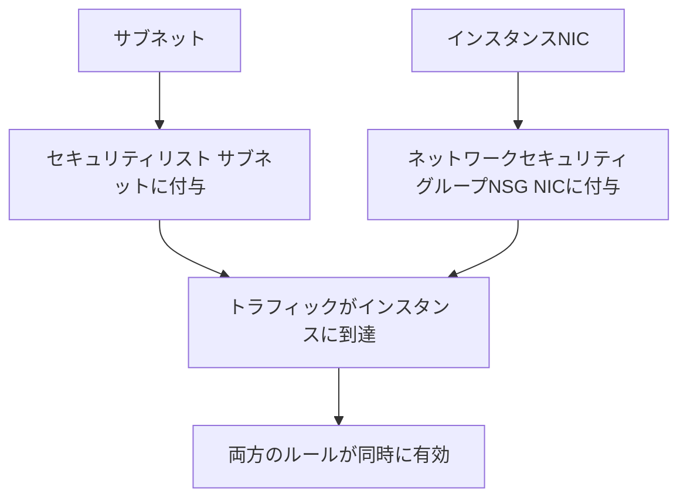

# セキュリティリストとNSG vs セキュリティグループ

一言で言うと:OCIには2種類のトラフィック制御機構があり、重ねて使用できる。AWSはセキュリティグループのみ。

## 要点
* セキュリティリスト(Security List):サブネットに付与され、初期のネットワークACLに似た考え方。サブネット内のすべてのインスタンスが同じルールセットを共有
* ネットワークセキュリティグループ(NSG):インスタンスのNICに付与され、ルールはインスタンスに追従する。ロジック上はAWSセキュリティグループにより近い
* 両者は同時に使用可能。トラフィックは両方のルールを同時に満たさなければ通過できない
* 移行の提案:NSGのみを使う場合、概念上AWSセキュリティグループとほぼ1対1で対応し、より扱いやすい
