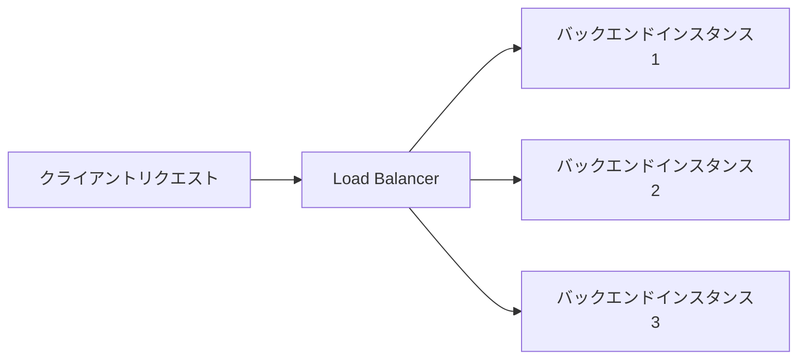

# Load Balancer vs ELB

一言で言うと:レイヤー4/レイヤー7ロードバランサーはELBに対応。OCIはさらに無料のレイヤー4ロードバランサー製品を提供する。

## 要点
* レイヤー7ロードバランサー:AWS ALBに対応、パス/ドメインベースのルーティングルールをサポート
* レイヤー4ロードバランサー:AWS NLBに対応。OCIが提供するレイヤー4のNetwork Load Balancerは公式価格ページによると無料(具体的には最新価格を確認)
* AWS NLBは通常時間単位と流量で課金される。これは両者の課金モデルにおける明確な違い
* ヘルスチェック、バックエンドプールの設定などの核心概念は完全に対応。AWSのロードバランサー設計経験をそのまま流用できる
