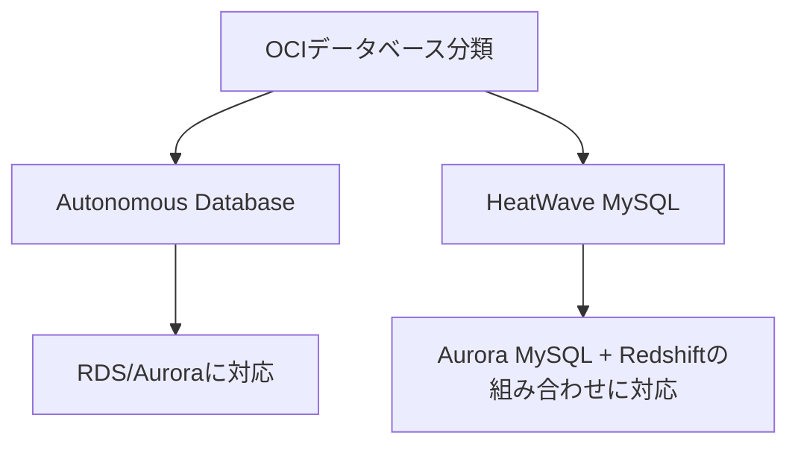

# データベース分類の概観

一言で言うと:データベースはOCIの核心的な強みの分野。本講座はAutonomous DatabaseとHeatWave MySQLという2つの代表的サービスに焦点を当てる。

## 要点
* Oracleのデータベース遺伝子により、OCIはデータベースサービスに最も深く投資している。AWSとの差別化の核心分野
* Autonomous Database:自律型データベース。Oracle Databaseエンジンを深く最適化
* HeatWave MySQL:フルマネージドMySQL。インメモリクエリアクセラレーションエンジンを内蔵し、1つのインスタンスでトランザクションと分析の両方を実行
* 続く2章でこの2つのサービスとAWSの対応製品との違いを深く解説
