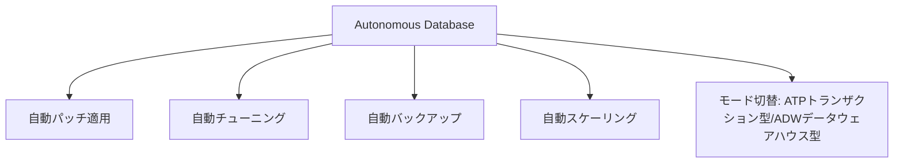

# Autonomous Database vs RDS/Aurora

一言で言うと:自律型データベースは日常的な運用作業を自動化し、Oracle Databaseエンジンに深く最適化されている。

## 要点
* AWS対応:RDS(マネージドだがチューニングと保守が必要)+ Aurora Serverless(自動スケーリング)を組み合わせたもの
* 核心的な違い:Oracle Databaseエンジンに特化して深く最適化されており、技術スタックがもともとOracle Databaseを使っている場合、AWSでRDS for Oracleを使うより価値が明確
* ATP(トランザクション処理)とADW(データウェアハウス)の2つのワークロードモード切替を提供
* 日常運用のチューニングに大量のDBA人員を投入したくないチームに適している
