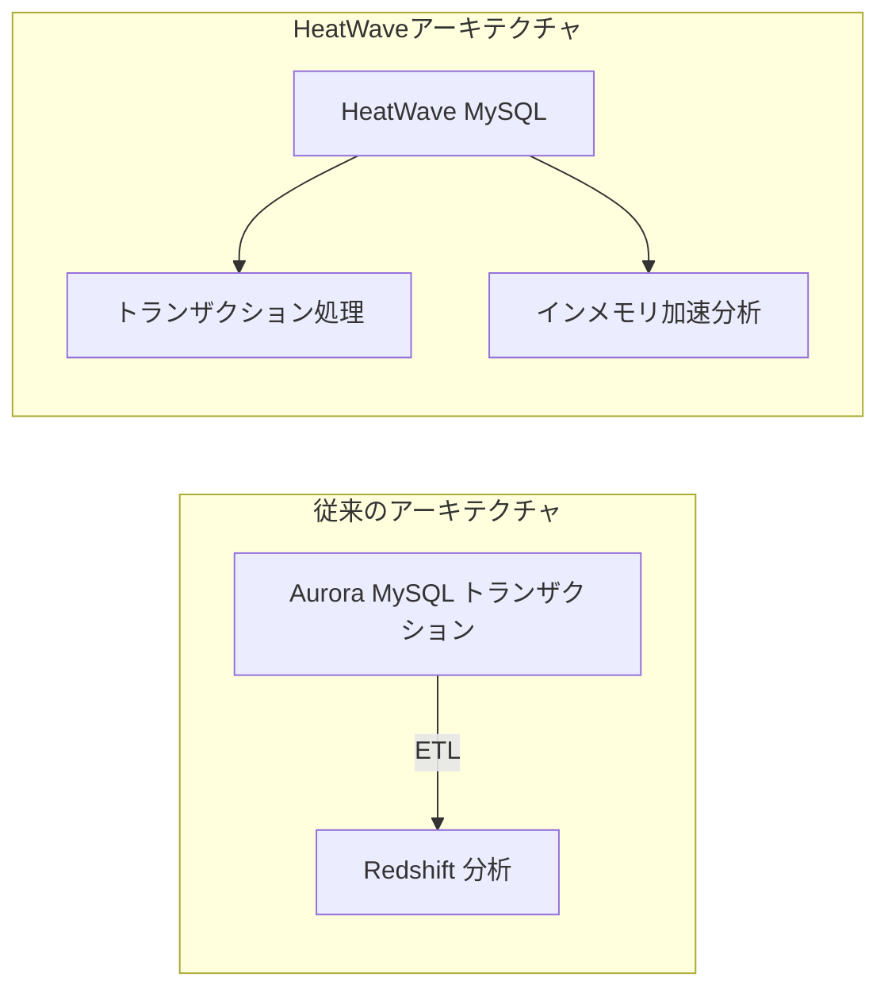

# HeatWave MySQL vs Aurora MySQL + Redshift

一言で言うと:1つのMySQLインスタンスにインメモリクエリアクセラレーションエンジンを内蔵し、トランザクション処理と分析クエリを同時に行い、ETLを不要にする。

## 要点
* AWS対応:通常Aurora MySQL(トランザクション)+ Redshift(分析)+ ETLパイプラインの組み合わせで実現
* HeatWave MySQL:同じMySQLインスタンス内にインメモリクエリアクセラレーションエンジンを内蔵し、分析クエリを直接実行
* メリット:ETLプロセスの複雑さ、遅延、追加コストを省ける
* 適している:アーキテクチャを簡略化しつつ「業務を書きながらリアルタイムでレポートを出す」能力が必要なチーム
