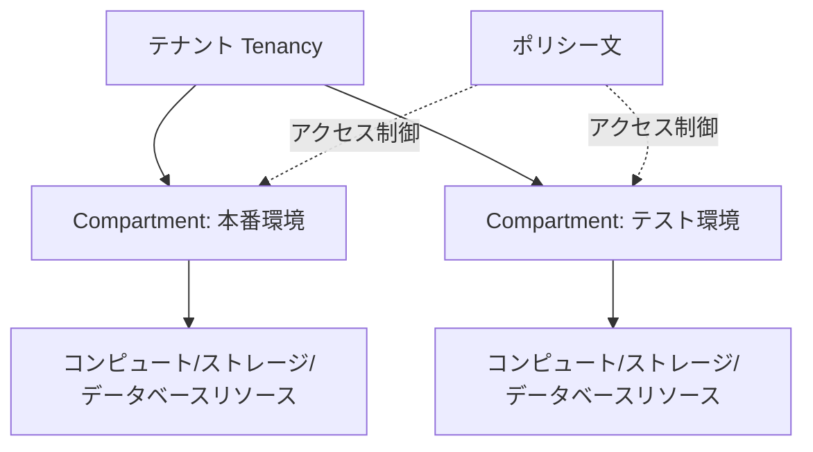

# IAMとCompartment vs AWS IAM

一言で言うと:OCIはCompartment(コンパートメント)でリソースを分離し、ポリシー構文はより自然言語に近い。

## 要点
* AWS IAM:アカウント + Organizationsベースの複数アカウント分離、ポリシーはJSON文書で記述
* OCI:単一テナント内でCompartmentのツリー構造を使ってリソース分離、複数アカウントに分ける必要がない
* ポリシー文:自然言語に近い、例 `Allow group Admins to manage all-resources in tenancy`
* トレードオフ:JSONポリシーより直感的で読みやすいが、複雑で精密なシナリオでの柔軟性はAWS IAMポリシー言語に劣る
