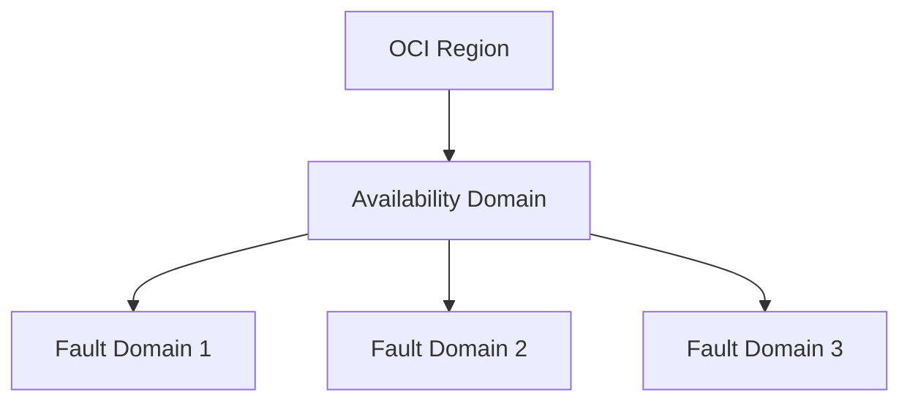

# アベイラビリティドメインと無料プラン:注意すべき細部

一言で言うと:リージョン内のアベイラビリティ単位の分割方法が異なり、無料プランは低コストで練習を始める良い出発点。

## 要点
* AWS:1つのRegionには通常複数のAZ(アベイラビリティゾーン)があり、自然にクロスAZの高可用性をサポート
* OCI:Region内で分割されるのはAvailability Domain(AD)。一部のリージョンはADが1つしかなく、同じAD内でさらにFault Domainを使って耐障害性の分離を行う
* 高可用性アーキテクチャを構築する前に、必ず対象リージョンのAD数を確認すること。AWSの複数AZという設計の前提をそのまま流用してはいけない
* Always Freeプランは力を入れている:2つのAutonomous Databaseインスタンス、一定量のArmコンピュートとストレージが長期無料。小規模システムの移行練習に適する
