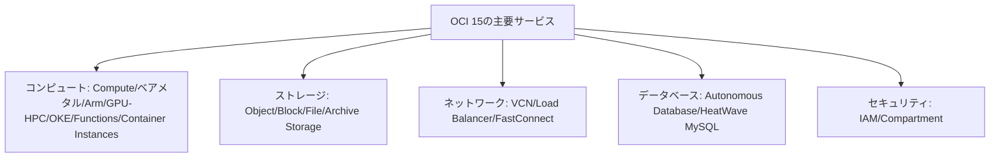

# まとめと発展的な考察

一言で言うと:講座全体を振り返り、15のOCIサービスと対応するAWSサービスを1つの完全な地図につなげる。

## 要点
* コンピュート:物理マシン全体からサーバーレス関数まで、AWSのEC2からLambdaまでのスペクトラムと完全対応
* ストレージ:Object/Block/File/Archiveの4種類のストレージがS3/EBS/EFS/Glacierに対応
* ネットワーク:VCN/Load Balancer/FastConnectがVPC/ELB/Direct Connectに対応
* データベース:Autonomous DatabaseとHeatWave MySQLはOCIがAWSと比べて最も差別化されている分野
* セキュリティ:Compartmentのツリー構造と自然言語のポリシーはAWS IAMとの違いが最も大きい部分
* 発展方向:マルチクラウド連携(Oracle Database@Azureなど)、Dedicated Regionといったより高度なテーマをさらに研究できる
