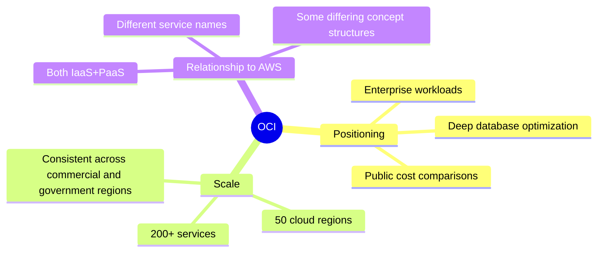

# Core Concept: What Is OCI

One-line summary: OCI is Oracle's second-generation infrastructure cloud, positioned around "enterprise workloads + lower cost."

## Key Points
* OCI = Oracle Cloud Infrastructure, Oracle's public cloud infrastructure platform
* Oracle states that all regions (including government/dedicated regions) offer consistent services and pricing
* Official cost comparison: compute 50% lower, block storage 70% lower, network egress 80% lower (based on September 2024 US East region pricing)
* Same IaaS+PaaS category as AWS, but invests more deeply in the database domain
