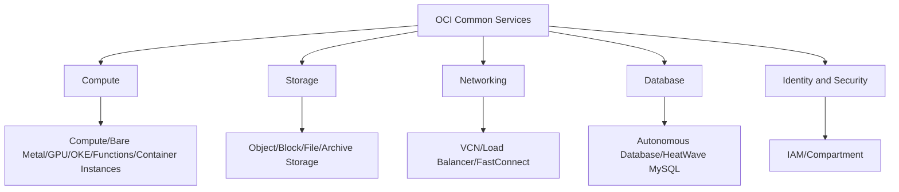

# Overall Structure: Five Categories of OCI Services

One-line summary: this course groups OCI's commonly used services into five categories, mapped to AWS one by one.

## Key Points
* Five categories: Compute, Storage, Networking, Database, Identity & Security
* Each category starts with an overview, then goes service-by-service against its AWS counterpart
* This course covers 15 commonly used OCI services - the highest-frequency subset of the 200+ services
* Learning order follows how you'd actually build an architecture: networking and compute first, then storage, then database, security last
