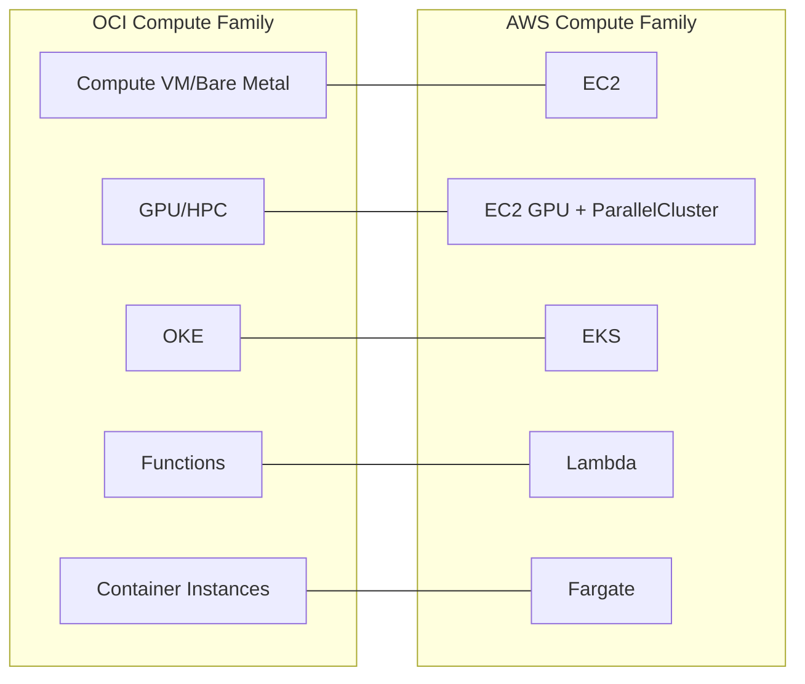

# Compute Category Overview: OCI Compute Family vs AWS EC2 Family

One-line summary: OCI's compute category maps to AWS's entire compute spectrum, from EC2 to Lambda.

## Key Points
* OCI's compute family spans the full spectrum from "a whole machine" to "a serverless function," fully matching AWS
* The next 7 chapters break down: VMs, billing units, bare metal, Arm, GPU/HPC, OKE, Functions, and Container Instances
* Compute is the category to understand first, since storage and networking both attach to compute instances
