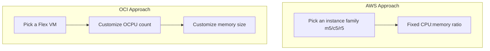

# VM Comparison: Flex VM vs EC2

One-line summary: OCI's Flex VM lets you assemble your own CPU-to-memory ratio, instead of picking a fixed instance family.

## Key Points
* AWS EC2: choose an instance family first (general-purpose m / compute-optimized c / memory-optimized r), the ratio is fixed
* OCI Flex VM: choose a Shape (like VM.Standard.E4.Flex) first, then freely enter the OCPU count and memory in GB
* Benefit: you're not forced to upgrade a whole tier and pay double for CPU just to get a few more GB of memory
* Bare metal is a separate form factor, covered in the next chapter
