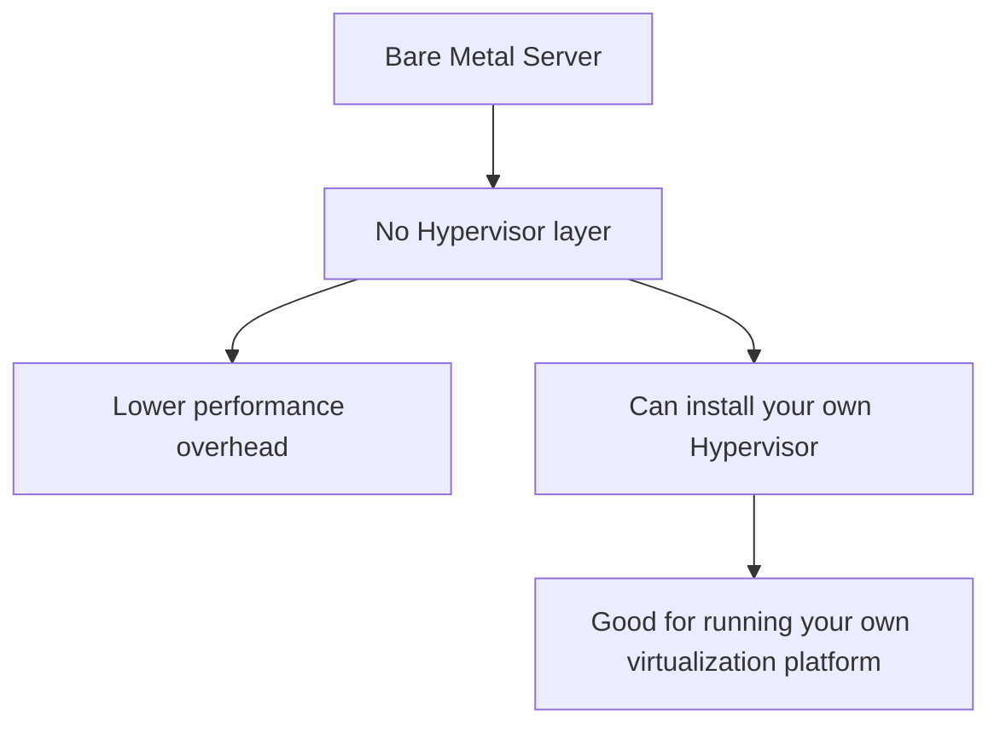

# Bare Metal Server Comparison

One-line summary: bare metal hands you a whole physical machine with no virtualization layer; OCI invested in this early.

## Key Points
* AWS equivalent: EC2 Bare Metal instances (e.g. the m5.metal series)
* OCI: bare metal was a heavy early investment area, so machine type selection tends to be rich
* Typical use cases: databases extremely sensitive to performance, or scenarios where you need to install your own Hypervisor (e.g. running VMware)
* Relationship to Flex VM: bare metal is "whole-machine exclusive use," Flex VM is "flexible-ratio virtual machines" - pick based on scenario
