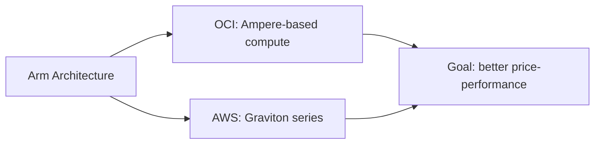

# Arm Compute Comparison: Ampere vs Graviton

One-line summary: both cloud vendors are chasing better price-performance with Arm-based chips.

## Key Points
* AWS Graviton: custom-designed Arm chips, chasing lower cost at the same performance level
* OCI's Arm-based compute: same Arm architecture, same goal
* The Always Free tier typically includes a certain amount of Arm compute, good for hands-on practice
* Migration note: same as moving to Graviton on AWS, confirm your software dependencies support the Arm architecture
