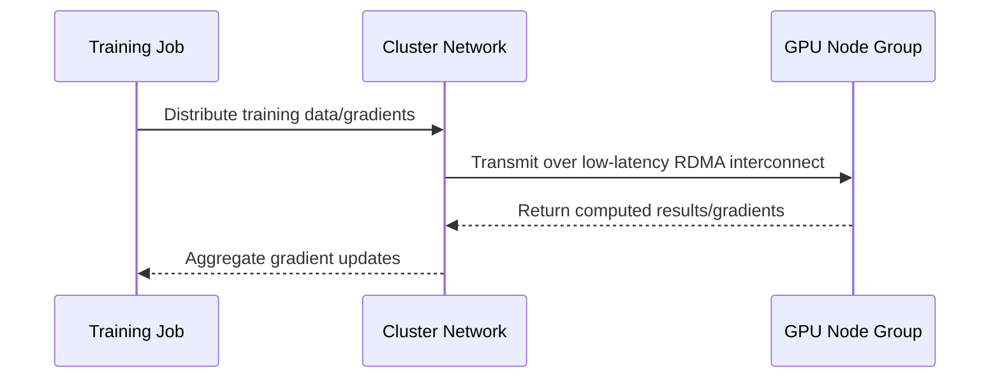

# GPU and HPC Compute Comparison

One-line summary: large-scale AI training needs low-latency cluster networking, and both vendors solve this with RDMA/EFA-type tech.

## Key Points
* AWS: EC2 P/G series GPU instances + EFA networking + UltraCluster; ParallelCluster manages HPC clusters
* OCI: primarily offers RDMA-interconnected bare-metal GPU clusters, commonly featuring H100/H200/B200
* Shared pain point: at scale, inter-node communication latency directly affects distributed training efficiency
* Selection key: don't just look at per-card compute - also evaluate cluster network architecture and interconnect bandwidth
