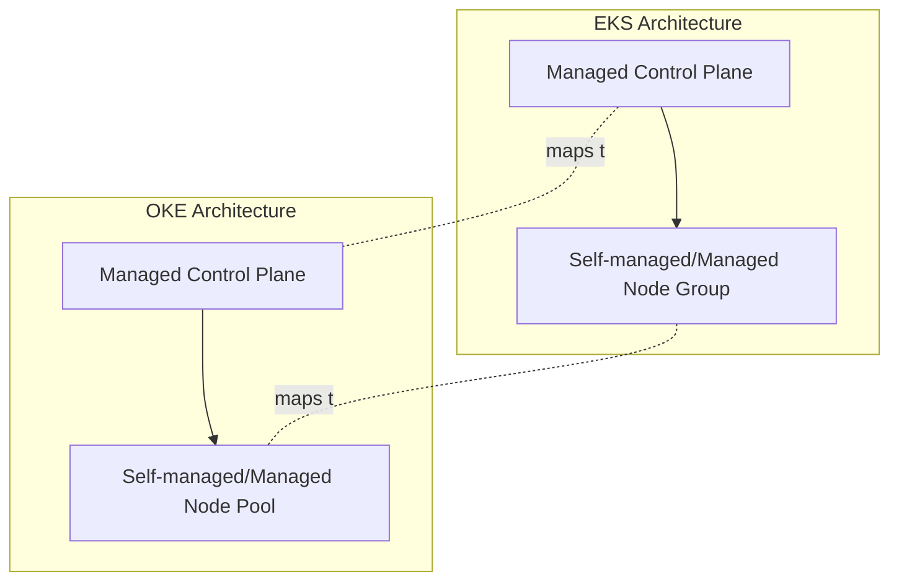

# OKE vs EKS: Managed Kubernetes Service

One-line summary: OKE is OCI's managed Kubernetes service, and the experience closely matches EKS.

## Key Points
* Both follow a "managed Control Plane + self-managed or managed Node Pool" structure
* OKE's Control Plane is currently free, but check the latest official pricing page for confirmation
* Node Pools can use regular VMs, bare metal, or even Arm or GPU nodes
* Migrating your Kubernetes YAML and manifests requires no major rewrite - mainly node pool and networking config need adjustment
