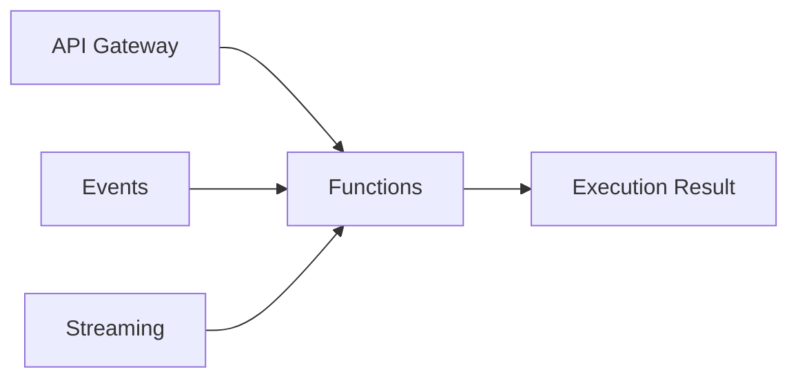

# Functions vs Lambda: Serverless Function Compute

One-line summary: OCI Functions is built on the open-source Fn Project, and its event-driven, pay-per-invocation model matches Lambda.

## Key Points
* AWS equivalent: Lambda
* Built on the open-source Fn Project, giving it some theoretical portability
* Triggers: API Gateway, Events, Streaming - similar to Lambda's trigger model
* Billing model: pay per invocation count and execution duration; cold-start optimization considerations similar to Lambda apply
