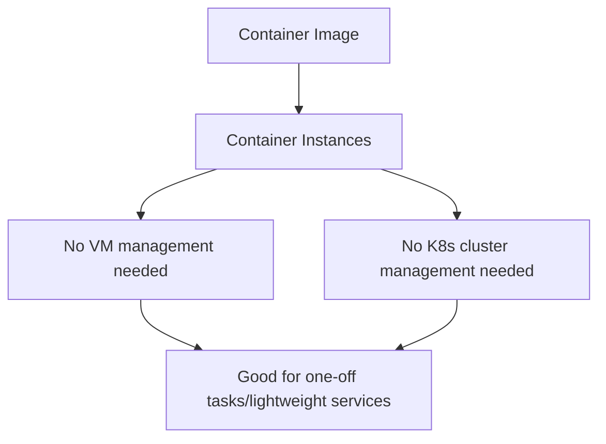

# Container Instances vs Fargate

One-line summary: run a single container or task directly, with no need to manage underlying VMs or a cluster.

## Key Points
* AWS equivalent: Fargate
* Use case: running a single task, batch job, or lightweight API service without standing up a dedicated Kubernetes cluster
* Difference from OKE: OKE targets complex, multi-container orchestration scenarios; Container Instances targets the simple "I just want to run a container" scenario
* Billing model: billed by the CPU/memory resources the container uses and its runtime duration, matching Fargate's logic
