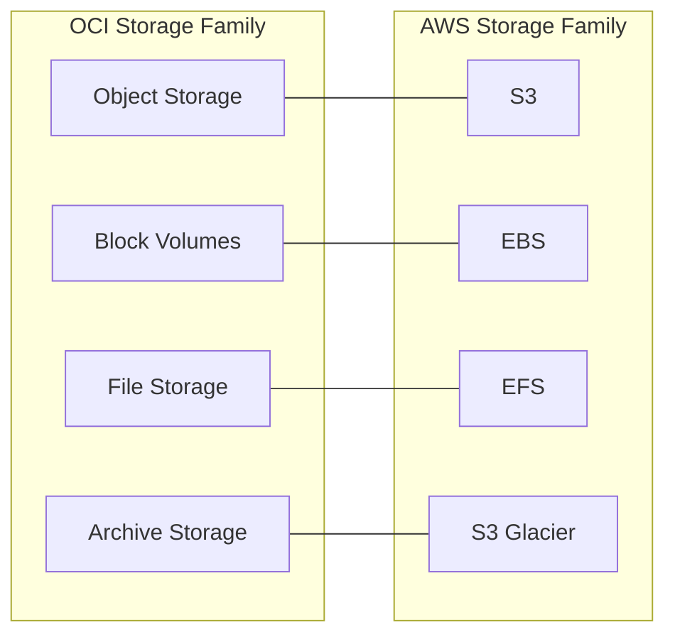

# Storage Category Overview

One-line summary: OCI's four storage services map to AWS's storage family - S3, EBS, EFS, and Glacier.

## Key Points
* Object Storage: object storage, maps to S3
* Block Volumes: block storage attached to compute instances, maps to EBS
* File Storage: managed NFS file system, maps to EFS
* Archive Storage: low-frequency, long-term archival, maps to Glacier
* Official differentiator: egress traffic pricing is significantly lower than mainstream cloud vendors
