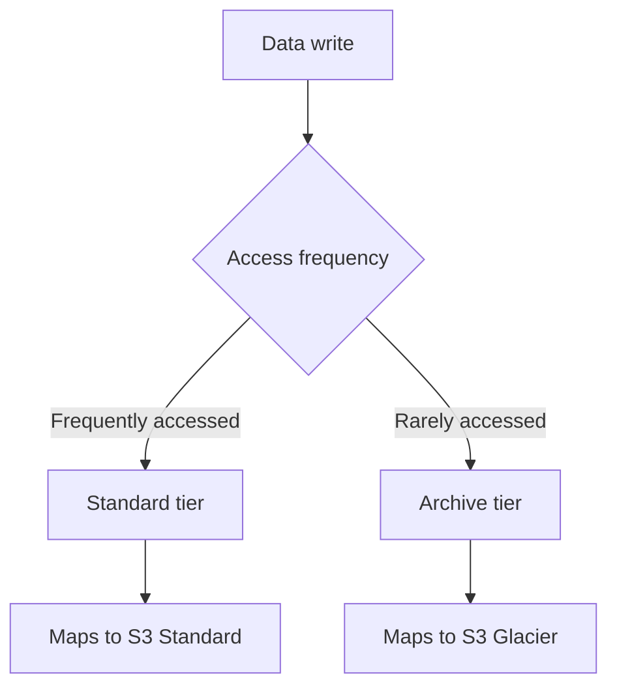

# Object Storage vs S3

One-line summary: object storage service, with standard/archive tiering logic similar to S3; egress pricing is the main difference.

## Key Points
* AWS equivalent: S3 (Standard tier) + S3 Glacier (Archive tier)
* Similar tiering logic: hot data in Standard, cold data in Archive
* Core difference: egress traffic pricing is officially framed as much lower than S3, giving a clearer cost edge for heavy download/origin-serving workloads
* Common uses: static site hosting, backups, data lake foundation, log archival
