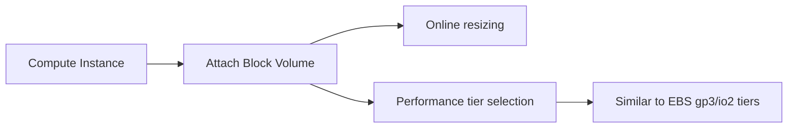

# Block Volumes vs EBS

One-line summary: block storage attached to compute instances, supporting online resizing and performance tiering.

## Key Points
* AWS equivalent: EBS
* Supports online resizing (adjust capacity without downtime)
* Performance tiering logic similar to EBS's gp3 (general-purpose) / io2 (high-performance)
* Use cases: database data volumes, application data directories needing persistence
