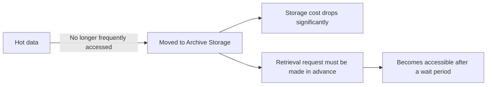

# Archive Storage vs Glacier

One-line summary: low-cost, long-term archival storage, trading retrieval latency for much lower storage costs.

## Key Points
* AWS equivalent: S3 Glacier / Glacier Deep Archive
* Suited for compliance retention, historical backups, and data that's rarely accessed but can't be deleted
* Retrieving data requires submitting a request in advance and waiting - it's not instantly accessible like the Standard tier
* Overall tiering logic: Standard (hot) → Archive (cold); all four storage services share this same hot/cold tiering philosophy
