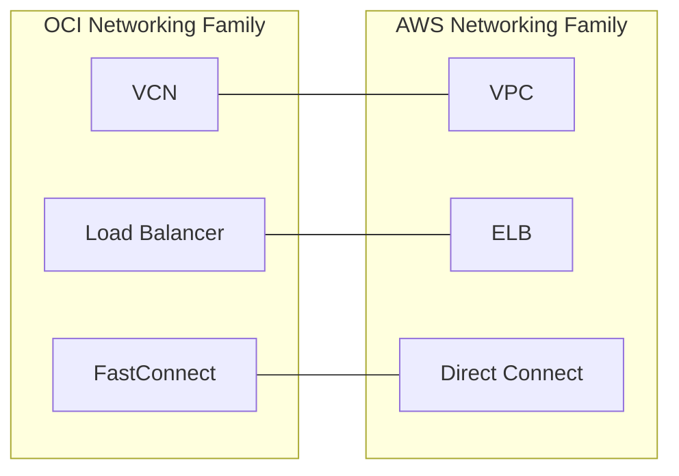

# Networking Category Overview

One-line summary: the three core networking services - VCN, Load Balancer, and FastConnect - map to VPC, ELB, and Direct Connect.

## Key Points
* VCN (Virtual Cloud Network): maps to VPC, the networking foundation for every deployment
* Load Balancer: maps to ELB (ALB/NLB)
* FastConnect: maps to Direct Connect, dedicated line access
* Networking is a connecting category: compute instances run inside a VCN, and private access for storage and databases also depends on it
