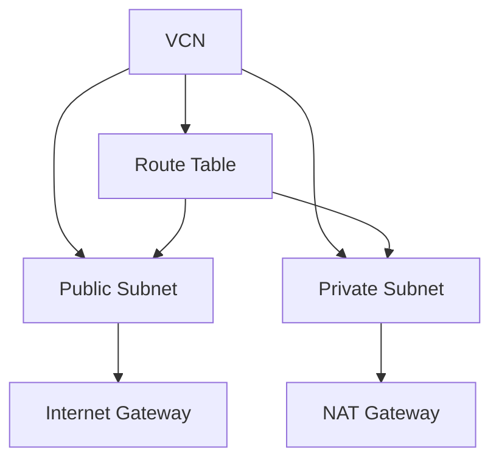

# VCN vs VPC

One-line summary: VCN is OCI's virtual private network - subnets, route tables, and gateways map essentially one-to-one with VPC.

## Key Points
* VCN = AWS's VPC; Subnet and Route Table concepts fully correspond
* Internet Gateway and NAT Gateway usage is consistent: public subnets talk to/from the public internet, private subnets only go outbound
* Compute instances, load balancers, and private database access are all built on top of VCN
* Security controls (Security Lists vs security groups) have some notable differences - covered in the next chapter
