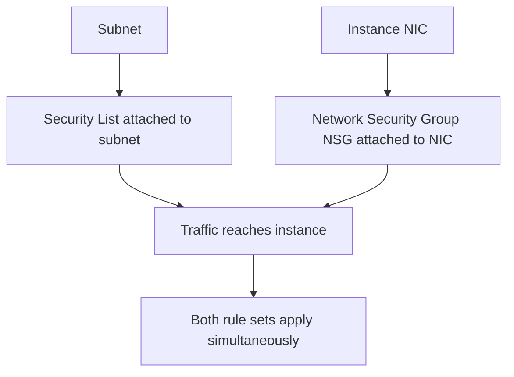

# Security Lists and NSG vs Security Groups

One-line summary: OCI provides two traffic-control mechanisms that can be layered together; AWS has only security groups.

## Key Points
* Security List: attached to a subnet, similar in philosophy to an early network ACL - all instances in a subnet share the same rule set
* Network Security Group (NSG): attached to an instance's NIC, rules follow the instance - logically closer to AWS security groups
* Both can be used together: traffic must satisfy both rule sets simultaneously to be allowed through
* Migration tip: if you use only NSGs, the concept maps nearly one-to-one with AWS security groups, making it easier to get started
