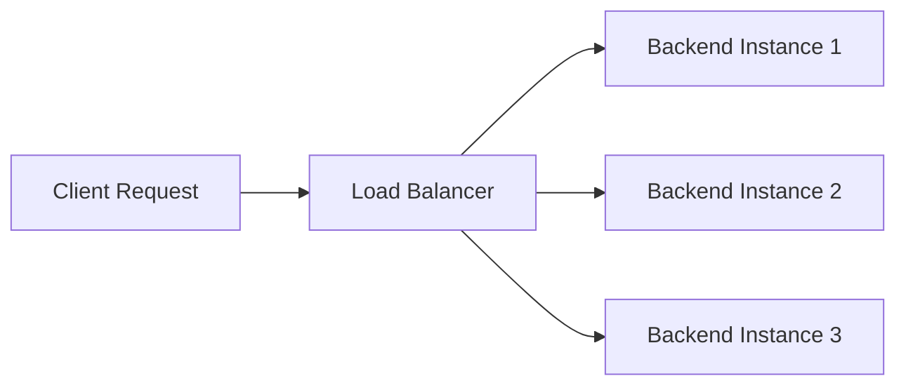

# Load Balancer vs ELB

One-line summary: Layer 4/7 load balancing maps to ELB, and OCI additionally offers a free Layer 4 load balancer product.

## Key Points
* Layer 7 load balancing: maps to AWS ALB, supports path/domain-based routing rules
* Layer 4 load balancing: maps to AWS NLB. OCI's Network Load Balancer is listed as free per its official pricing page (check the latest pricing for confirmation)
* AWS NLB is typically billed hourly plus by traffic - a clear billing model difference between the two
* Core concepts like health checks and backend pool configuration map completely, so you can reuse AWS load balancer design experience
