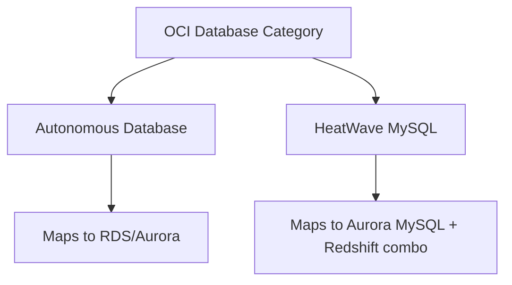

# Database Category Overview

One-line summary: database is OCI's core strength; this course focuses on two flagship services - Autonomous Database and HeatWave MySQL.

## Key Points
* Oracle's database heritage means OCI invests most heavily here - the core area of differentiation from AWS
* Autonomous Database: a self-driving database, deeply optimized Oracle Database engine
* HeatWave MySQL: fully managed MySQL with a built-in in-memory query acceleration engine, doing both transactions and analytics in one instance
* The next two chapters go deep into how these two services differ from their AWS counterparts
