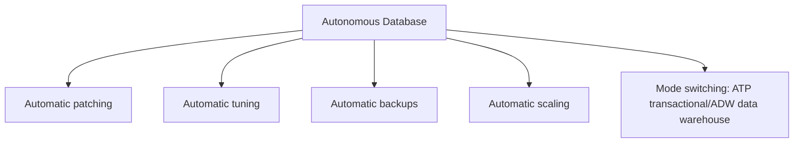

# Autonomous Database vs RDS/Aurora

One-line summary: a self-driving database that automates day-to-day operational work and is deeply optimized for the Oracle Database engine.

## Key Points
* AWS equivalent: a combination of RDS (managed but still needs tuning and maintenance) + Aurora Serverless (auto-scaling)
* Core difference: deeply optimized specifically for the Oracle Database engine - if your stack already runs Oracle Database, the value is clearer than using RDS for Oracle on AWS
* Offers ATP (transaction processing) and ADW (data warehouse) workload mode switching
* Suited for teams that don't want to invest heavy DBA staffing into day-to-day operational tuning
