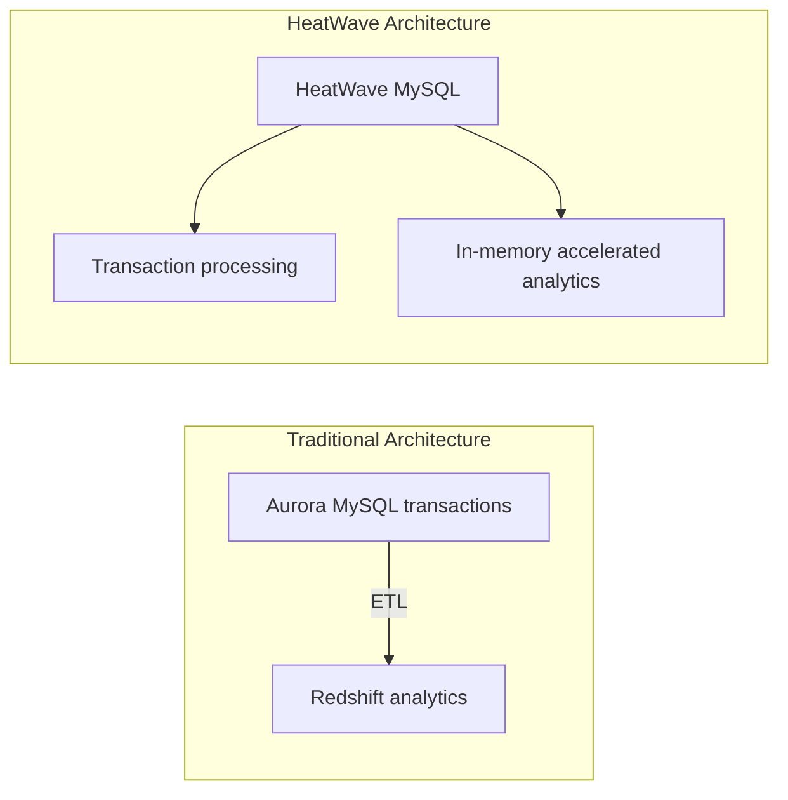

# HeatWave MySQL vs Aurora MySQL + Redshift

One-line summary: a single MySQL instance with a built-in in-memory query acceleration engine handles both transactions and analytics, skipping ETL.

## Key Points
* AWS equivalent: typically achieved with Aurora MySQL (transactions) + Redshift (analytics) + an ETL pipeline
* HeatWave MySQL: has a built-in in-memory query acceleration engine within the same MySQL instance, running analytical queries directly
* Advantage: eliminates the complexity, latency, and extra cost of an ETL process
* Suited for teams that want to simplify their architecture while still needing "write to the business database and get real-time reports" capability
