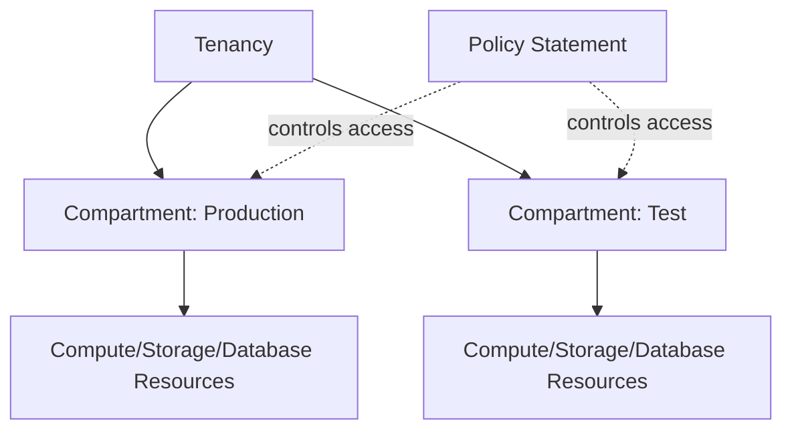

# IAM and Compartment vs AWS IAM

One-line summary: OCI uses Compartments for resource isolation, and its policy syntax reads more like natural language.

## Key Points
* AWS IAM: multi-account isolation via accounts + Organizations, policies described as JSON documents
* OCI: uses a Compartment tree structure within a single tenancy for resource isolation, without needing to split into multiple accounts
* Policy statements: closer to natural language, e.g. `Allow group Admins to manage all-resources in tenancy`
* Trade-off: more intuitive and readable than JSON policies, but less flexible than AWS's IAM policy language for complex, fine-grained scenarios
