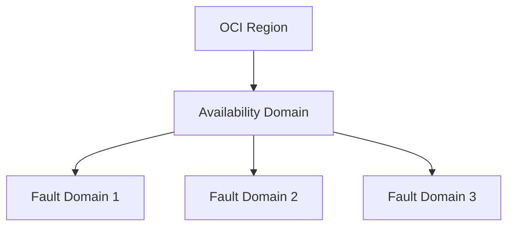

# Availability Domains and Free Tier: Details Worth Watching

One-line summary: the way availability units are divided within a region differs, and the Free Tier is a great low-cost place to practice.

## Key Points
* AWS: a Region typically has multiple AZs, naturally supporting cross-AZ high availability
* OCI: a Region is divided into Availability Domains (ADs) - some regions only have 1 AD, and Fault Domains handle fault-tolerance isolation within the same AD
* Before designing for high availability, confirm the AD count of your target region - don't assume AWS's multi-AZ design pattern carries over
* Always Free tier is generous: 2 Autonomous Database instances, some Arm compute and storage, free indefinitely - a good place to migrate a small system and practice
