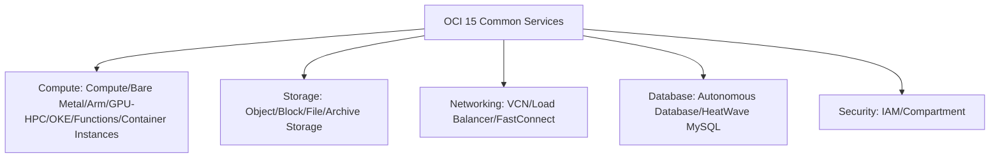

# Summary and Further Reflection

One-line summary: recap the whole course, connecting 15 OCI services and their AWS counterparts into one complete map.

## Key Points
* Compute: from a whole machine to a serverless function, fully mapping AWS's spectrum from EC2 to Lambda
* Storage: Object/Block/File/Archive map to S3/EBS/EFS/Glacier
* Networking: VCN/Load Balancer/FastConnect map to VPC/ELB/Direct Connect
* Database: Autonomous Database and HeatWave MySQL are where OCI is most differentiated from AWS
* Security: the Compartment tree structure and natural-language policies are the area with the biggest divergence from AWS IAM
* Directions to explore further: multi-cloud interconnects (e.g. Oracle Database@Azure), Dedicated Region, and other advanced topics
