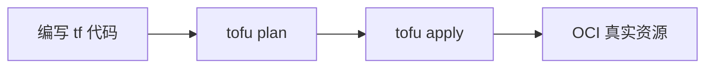

# OpenTofu 是什么：从手动点击到基础设施即代码

了解 OpenTofu 要解决的核心问题，以及本教程中 OCI 的准确含义。

## 核心要点

* OpenTofu 是一个 IaC 工具，用 .tf 文件描述希望 OCI 上最终存在什么资源
* 本教程中的 OCI 指 Oracle Cloud Infrastructure，不是 Open Container Initiative
* 核心价值：可重复、可审查、可追踪、可恢复、可比较、可模块化
* 手动操作依赖人工点击 Console，OpenTofu 依赖代码和自动执行

---

## 本章测验

本章共 5 道单项选择题。

### 第 1 题

本教程中提到的 OCI 主要代表什么？

- A. Oracle Cloud Infrastructure
- B. Open Container Initiative
- C. Object Cloud Index
- D. Open Compute Infrastructure

选择答案后查看结果

正确答案：A

答案解析：本教程中的 OCI 指 Oracle Cloud Infrastructure，即用户要管理的云平台；Open Container Initiative 是另一个同名缩写，属于容器镜像标准，与本教程无关。

### 第 2 题

OpenTofu 的主要作用是什么？

- A. 监控服务器硬件性能
- B. 通过代码描述并管理云基础设施
- C. 编写前端页面样式
- D. 管理数据库表结构

选择答案后查看结果

正确答案：B

答案解析：OpenTofu 是 IaC 工具，通过 .tf 代码描述期望的基础设施状态，再由它负责创建和修改 OCI 资源。

### 第 3 题

与手动在 OCI Console 中点击创建资源相比，使用 OpenTofu 的关键优势是什么？

- A. 完全不需要了解 OCI 资源
- B. 不需要任何网络连接
- C. 变更可以通过 Git Pull Request 审查并重复执行
- D. 只能用来创建虚拟机

选择答案后查看结果

正确答案：C

答案解析：文中强调基础设施变更可以通过 Git PR 审查，且同一套代码可以在测试和生产环境重复使用，这是手动点击无法做到的。

### 第 4 题

下列哪一项不是文中提到的 OpenTofu 价值？

- A. 可审查
- B. 可恢复
- C. 可模块化
- D. 自动优化云账单支出

选择答案后查看结果

正确答案：D

答案解析：文中列出的价值是可重复、可审查、可追踪、可恢复、可比较、可模块化，并未提到自动优化账单这一功能。

### 第 5 题

如果团队希望测试环境和生产环境使用同一套代码来创建基础设施，这体现了 OpenTofu 的哪个特性？

- A. 可重复
- B. 可审查
- C. 可比较
- D. 可模块化

选择答案后查看结果

正确答案：A

答案解析：文中明确指出“可重复：测试环境、生产环境可以使用同一套代码”，这正是可重复特性的体现。

<!-- QUIZ_DATA_START
{
  "chapter": "01",
  "questions": [
    {
      "id": 1,
      "question": "本教程中提到的 OCI 主要代表什么？",
      "options": {
        "A": "Oracle Cloud Infrastructure",
        "B": "Open Container Initiative",
        "C": "Object Cloud Index",
        "D": "Open Compute Infrastructure"
      },
      "answer": "A",
      "explanation": "本教程中的 OCI 指 Oracle Cloud Infrastructure，即用户要管理的云平台；Open Container Initiative 是另一个同名缩写，属于容器镜像标准，与本教程无关。"
    },
    {
      "id": 2,
      "question": "OpenTofu 的主要作用是什么？",
      "options": {
        "B": "通过代码描述并管理云基础设施",
        "A": "监控服务器硬件性能",
        "C": "编写前端页面样式",
        "D": "管理数据库表结构"
      },
      "answer": "B",
      "explanation": "OpenTofu 是 IaC 工具，通过 .tf 代码描述期望的基础设施状态，再由它负责创建和修改 OCI 资源。"
    },
    {
      "id": 3,
      "question": "与手动在 OCI Console 中点击创建资源相比，使用 OpenTofu 的关键优势是什么？",
      "options": {
        "C": "变更可以通过 Git Pull Request 审查并重复执行",
        "A": "完全不需要了解 OCI 资源",
        "B": "不需要任何网络连接",
        "D": "只能用来创建虚拟机"
      },
      "answer": "C",
      "explanation": "文中强调基础设施变更可以通过 Git PR 审查，且同一套代码可以在测试和生产环境重复使用，这是手动点击无法做到的。"
    },
    {
      "id": 4,
      "question": "下列哪一项不是文中提到的 OpenTofu 价值？",
      "options": {
        "D": "自动优化云账单支出",
        "A": "可审查",
        "B": "可恢复",
        "C": "可模块化"
      },
      "answer": "D",
      "explanation": "文中列出的价值是可重复、可审查、可追踪、可恢复、可比较、可模块化，并未提到自动优化账单这一功能。"
    },
    {
      "id": 5,
      "question": "如果团队希望测试环境和生产环境使用同一套代码来创建基础设施，这体现了 OpenTofu 的哪个特性？",
      "options": {
        "A": "可重复",
        "B": "可审查",
        "C": "可比较",
        "D": "可模块化"
      },
      "answer": "A",
      "explanation": "文中明确指出“可重复：测试环境、生产环境可以使用同一套代码”，这正是可重复特性的体现。"
    }
  ]
}
QUIZ_DATA_END -->
