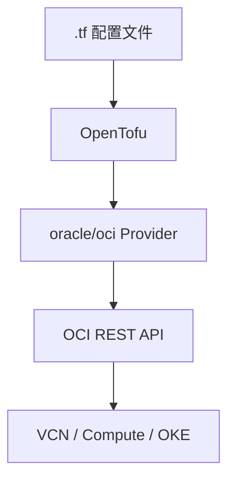

# OpenTofu 核心概念（一）：Configuration 与 Provider

理解 OpenTofu 骨架中最基础的两个概念：配置代码和云平台插件。

## 核心要点

* Configuration 是 .tf 或 .tofu 文件，文件名主要用于组织代码，不决定执行顺序
* 常见文件划分：versions.tf、provider.tf、variables.tf、main.tf、outputs.tf
* Provider 是 OpenTofu 与外部系统交互的插件，OpenTofu 本身不知道怎样创建 OCI 资源
* 每个配置都应声明所需 Provider 及版本范围

---

## 本章测验

本章共 5 道单项选择题。

### 第 1 题

OpenTofu 中 .tf 文件的文件名主要作用是什么？

- A. 决定资源的创建顺序
- B. 组织代码，不影响执行顺序
- C. 决定 State 文件的位置
- D. 决定 Provider 的版本

选择答案后查看结果

正确答案：B

答案解析：文中指出 OpenTofu 会读取当前目录下所有配置文件，文件名主要用于组织代码，不决定执行顺序。

### 第 2 题

OpenTofu 是如何创建 OCI VCN 这样的资源的？

- A. OpenTofu 内置了所有云平台的创建逻辑
- B. 直接修改 OCI 数据库
- C. 通过 Provider 插件调用 OCI API
- D. 通过邮件通知 OCI 管理员

选择答案后查看结果

正确答案：C

答案解析：OpenTofu 本身并不知道怎样创建 OCI VCN，它通过 oracle/oci Provider 调用 OCI REST API 完成实际操作。

### 第 3 题

下列哪一项不属于文中提到的常见配置文件？

- A. versions.tf
- B. provider.tf
- C. variables.tf
- D. billing.tf

选择答案后查看结果

正确答案：D

答案解析：文中列出的常见文件是 versions.tf、provider.tf、variables.tf、main.tf、outputs.tf，并没有 billing.tf。

### 第 4 题

关于 Provider，下列说法正确的是？

- A. 每个配置都应声明所需 Provider 及版本范围
- B. Provider 与 OpenTofu 无关，只在 Terraform 中使用
- C. Provider 只能用来创建 Compute 实例
- D. 一个配置最多只能声明一个 Provider

选择答案后查看结果

正确答案：A

答案解析：文中指出每个配置都应声明所需 Provider 及版本范围，这样才能确保 OpenTofu 正确下载和使用对应插件。

### 第 5 题

如果要在 OpenTofu 中管理 OCI 的 Compute、VCN 和 OKE 资源，需要依赖什么？

- A. OCI CLI 单独安装
- B. oracle/oci Provider
- C. 直接编写 Shell 脚本调用 API
- D. 无需任何插件

选择答案后查看结果

正确答案：B

答案解析：Compute、VCN、OKE 等资源的创建都通过 oracle/oci Provider 这个插件调用 OCI REST API 完成。

<!-- QUIZ_DATA_START
{
  "chapter": "02",
  "questions": [
    {
      "id": 1,
      "question": "OpenTofu 中 .tf 文件的文件名主要作用是什么？",
      "options": {
        "B": "组织代码，不影响执行顺序",
        "A": "决定资源的创建顺序",
        "C": "决定 State 文件的位置",
        "D": "决定 Provider 的版本"
      },
      "answer": "B",
      "explanation": "文中指出 OpenTofu 会读取当前目录下所有配置文件，文件名主要用于组织代码，不决定执行顺序。"
    },
    {
      "id": 2,
      "question": "OpenTofu 是如何创建 OCI VCN 这样的资源的？",
      "options": {
        "C": "通过 Provider 插件调用 OCI API",
        "A": "OpenTofu 内置了所有云平台的创建逻辑",
        "B": "直接修改 OCI 数据库",
        "D": "通过邮件通知 OCI 管理员"
      },
      "answer": "C",
      "explanation": "OpenTofu 本身并不知道怎样创建 OCI VCN，它通过 oracle/oci Provider 调用 OCI REST API 完成实际操作。"
    },
    {
      "id": 3,
      "question": "下列哪一项不属于文中提到的常见配置文件？",
      "options": {
        "D": "billing.tf",
        "A": "versions.tf",
        "B": "provider.tf",
        "C": "variables.tf"
      },
      "answer": "D",
      "explanation": "文中列出的常见文件是 versions.tf、provider.tf、variables.tf、main.tf、outputs.tf，并没有 billing.tf。"
    },
    {
      "id": 4,
      "question": "关于 Provider，下列说法正确的是？",
      "options": {
        "A": "每个配置都应声明所需 Provider 及版本范围",
        "B": "Provider 与 OpenTofu 无关，只在 Terraform 中使用",
        "C": "Provider 只能用来创建 Compute 实例",
        "D": "一个配置最多只能声明一个 Provider"
      },
      "answer": "A",
      "explanation": "文中指出每个配置都应声明所需 Provider 及版本范围，这样才能确保 OpenTofu 正确下载和使用对应插件。"
    },
    {
      "id": 5,
      "question": "如果要在 OpenTofu 中管理 OCI 的 Compute、VCN 和 OKE 资源，需要依赖什么？",
      "options": {
        "B": "oracle/oci Provider",
        "A": "OCI CLI 单独安装",
        "C": "直接编写 Shell 脚本调用 API",
        "D": "无需任何插件"
      },
      "answer": "B",
      "explanation": "Compute、VCN、OKE 等资源的创建都通过 oracle/oci Provider 这个插件调用 OCI REST API 完成。"
    }
  ]
}
QUIZ_DATA_END -->
