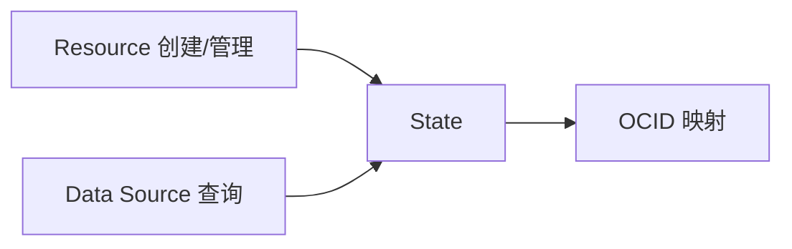

# OpenTofu 核心概念（二）：Resource、Data Source 与 State

理解“要管理的资源”、“查询现有资源”与“状态追踪”三者的关系。

## 核心要点

* Resource（如 oci_core_vcn.main）是要创建或管理的资源，oci_core_vcn 是类型，main 是逻辑名称
* Data Source（如 oci_identity_availability_domains.ads）用于查询已存在的资源，不创建也不修改
* State 默认文件名是 terraform.tfstate，用于保存代码地址与真实 OCID 的映射
* 不要手工修改 State 文件，也不要把包含敏感数据的 State 提交到公开 GitHub

---

## 本章测验

本章共 5 道单项选择题。

### 第 1 题

在 oci_core_vcn.main 这个引用地址中，main 代表什么？

- A. OCI 官方资源类型
- B. OCID 的一部分
- C. 当前代码内部使用的逻辑名称
- D. Provider 的别名

选择答案后查看结果

正确答案：C

答案解析：oci_core_vcn 是 OCI Provider 中的资源类型，main 是当前代码内部使用的逻辑名称，两者组合成完整引用地址。

### 第 2 题

Data Source 与 Resource 的主要区别是什么？

- A. Data Source 用于创建资源，Resource 用于查询资源
- B. 两者完全相同，只是名字不同
- C. Data Source 只能用于 Compute 资源
- D. Data Source 用于查询现有资源，Resource 用于创建或管理资源

选择答案后查看结果

正确答案：D

答案解析：文中明确指出 Resource 是“创建或管理”，Data Source 是“查询”，例如查询 OCI Availability Domain 就使用 Data Source。

### 第 3 题

尽管工具名称是 OpenTofu，默认 State 文件名是什么？

- A. terraform.tfstate
- B. opentofu.tfstate
- C. state.json
- D. oci.tfstate

选择答案后查看结果

正确答案：A

答案解析：文中说明为了兼容现有生态，默认 State 文件名仍然保留 terraform.tfstate。

### 第 4 题

关于 State 文件，下列做法正确的是？

- A. 可以手工修改 State 文件以加快操作
- B. 不要手工修改 State，也不要把敏感 State 提交到公开仓库
- C. 可以把包含敏感数据的 State 提交到公开 GitHub
- D. State 文件不需要保留

选择答案后查看结果

正确答案：B

答案解析：文中特别强调不要手工修改 State 文件，也不要把包含敏感数据的 State 提交到公开 GitHub。

### 第 5 题

如果要查询当前 OCI 租户下有哪些可用域（Availability Domain），应该使用什么？

- A. Resource
- B. Output
- C. Data Source
- D. Local

选择答案后查看结果

正确答案：C

答案解析：查询已存在的信息（如可用域列表）属于查询操作，应该使用 Data Source，例如 data "oci_identity_availability_domains"。

<!-- QUIZ_DATA_START
{
  "chapter": "03",
  "questions": [
    {
      "id": 1,
      "question": "在 oci_core_vcn.main 这个引用地址中，main 代表什么？",
      "options": {
        "C": "当前代码内部使用的逻辑名称",
        "A": "OCI 官方资源类型",
        "B": "OCID 的一部分",
        "D": "Provider 的别名"
      },
      "answer": "C",
      "explanation": "oci_core_vcn 是 OCI Provider 中的资源类型，main 是当前代码内部使用的逻辑名称，两者组合成完整引用地址。"
    },
    {
      "id": 2,
      "question": "Data Source 与 Resource 的主要区别是什么？",
      "options": {
        "D": "Data Source 用于查询现有资源，Resource 用于创建或管理资源",
        "A": "Data Source 用于创建资源，Resource 用于查询资源",
        "B": "两者完全相同，只是名字不同",
        "C": "Data Source 只能用于 Compute 资源"
      },
      "answer": "D",
      "explanation": "文中明确指出 Resource 是“创建或管理”，Data Source 是“查询”，例如查询 OCI Availability Domain 就使用 Data Source。"
    },
    {
      "id": 3,
      "question": "尽管工具名称是 OpenTofu，默认 State 文件名是什么？",
      "options": {
        "A": "terraform.tfstate",
        "B": "opentofu.tfstate",
        "C": "state.json",
        "D": "oci.tfstate"
      },
      "answer": "A",
      "explanation": "文中说明为了兼容现有生态，默认 State 文件名仍然保留 terraform.tfstate。"
    },
    {
      "id": 4,
      "question": "关于 State 文件，下列做法正确的是？",
      "options": {
        "B": "不要手工修改 State，也不要把敏感 State 提交到公开仓库",
        "A": "可以手工修改 State 文件以加快操作",
        "C": "可以把包含敏感数据的 State 提交到公开 GitHub",
        "D": "State 文件不需要保留"
      },
      "answer": "B",
      "explanation": "文中特别强调不要手工修改 State 文件，也不要把包含敏感数据的 State 提交到公开 GitHub。"
    },
    {
      "id": 5,
      "question": "如果要查询当前 OCI 租户下有哪些可用域（Availability Domain），应该使用什么？",
      "options": {
        "C": "Data Source",
        "A": "Resource",
        "B": "Output",
        "D": "Local"
      },
      "answer": "C",
      "explanation": "查询已存在的信息（如可用域列表）属于查询操作，应该使用 Data Source，例如 data \"oci_identity_availability_domains\"。"
    }
  ]
}
QUIZ_DATA_END -->
