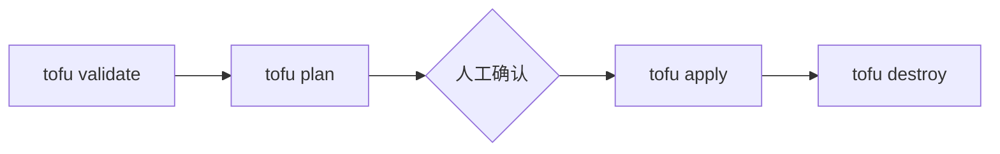

# 标准工作流程（二）：plan、apply、destroy

了解从预览变更到真正执行、再到清理资源的最后三步。

## 核心要点

* tofu plan 生成变更计划，符号含义：+ 创建，~ 原地修改，-/+ 删除后重建，- 删除
* 生产环境推荐先 tofu plan -out=tfplan 保存计划，再 tofu apply tfplan 执行经过审核的计划
* tofu apply -auto-approve 可用于本地学习，但生产环境不推荐随意使用
* tofu destroy 会删除当前 State 管理的所有资源

---

## 本章测验

本章共 5 道单项选择题。

### 第 1 题

在 tofu plan 输出中，符号 ~ 表示什么？

- A. 原地修改资源
- B. 创建新资源
- C. 删除资源
- D. 先删除再重建资源

选择答案后查看结果

正确答案：A

答案解析：文中列出的符号含义为：+ 创建，~ 原地修改，-/+ 删除后重建，- 删除，所以 ~ 表示原地修改。

### 第 2 题

生产环境中推荐的执行方式是什么？

- A. 直接运行 tofu apply -auto-approve
- B. 先 tofu plan -out=tfplan 保存计划，再 tofu apply tfplan
- C. 跳过 plan 直接 apply
- D. 只运行 tofu destroy

选择答案后查看结果

正确答案：B

答案解析：文中建议生产环境推荐保存 Plan，再对经过审核的 Plan 执行 apply，这样实际执行的就是经过审核的内容。

### 第 3 题

tofu apply -auto-approve 适合用在什么场景？

- A. 生产环境的日常变更
- B. 所有场景都推荐使用
- C. 本地学习场景
- D. 只能用于 destroy 命令

选择答案后查看结果

正确答案：C

答案解析：文中指出本地学习可以使用 -auto-approve，但生产环境不推荐随意加这个参数，因为它会跳过人工确认。

### 第 4 题

tofu destroy 命令的作用是什么？

- A. 格式化代码
- B. 下载 Provider
- C. 生成变更计划但不执行
- D. 删除当前 State 管理的资源

选择答案后查看结果

正确答案：D

答案解析：文中明确说明 tofu destroy 用于删除当前 State 管理的资源。

### 第 5 题

如果 plan 输出中出现 -/+ 符号，意味着什么？

- A. 资源将被删除后重新创建
- B. 资源将被原地修改，不会重建
- C. 该资源不会有任何变化
- D. 该资源已经存在但无法读取

选择答案后查看结果

正确答案：A

答案解析：-/+ 表示删除后重建，通常出现在无法原地修改、必须替换资源的属性变更场景中。

<!-- QUIZ_DATA_START
{
  "chapter": "05",
  "questions": [
    {
      "id": 1,
      "question": "在 tofu plan 输出中，符号 ~ 表示什么？",
      "options": {
        "A": "原地修改资源",
        "B": "创建新资源",
        "C": "删除资源",
        "D": "先删除再重建资源"
      },
      "answer": "A",
      "explanation": "文中列出的符号含义为：+ 创建，~ 原地修改，-/+ 删除后重建，- 删除，所以 ~ 表示原地修改。"
    },
    {
      "id": 2,
      "question": "生产环境中推荐的执行方式是什么？",
      "options": {
        "B": "先 tofu plan -out=tfplan 保存计划，再 tofu apply tfplan",
        "A": "直接运行 tofu apply -auto-approve",
        "C": "跳过 plan 直接 apply",
        "D": "只运行 tofu destroy"
      },
      "answer": "B",
      "explanation": "文中建议生产环境推荐保存 Plan，再对经过审核的 Plan 执行 apply，这样实际执行的就是经过审核的内容。"
    },
    {
      "id": 3,
      "question": "tofu apply -auto-approve 适合用在什么场景？",
      "options": {
        "C": "本地学习场景",
        "A": "生产环境的日常变更",
        "B": "所有场景都推荐使用",
        "D": "只能用于 destroy 命令"
      },
      "answer": "C",
      "explanation": "文中指出本地学习可以使用 -auto-approve，但生产环境不推荐随意加这个参数，因为它会跳过人工确认。"
    },
    {
      "id": 4,
      "question": "tofu destroy 命令的作用是什么？",
      "options": {
        "D": "删除当前 State 管理的资源",
        "A": "格式化代码",
        "B": "下载 Provider",
        "C": "生成变更计划但不执行"
      },
      "answer": "D",
      "explanation": "文中明确说明 tofu destroy 用于删除当前 State 管理的资源。"
    },
    {
      "id": 5,
      "question": "如果 plan 输出中出现 -/+ 符号，意味着什么？",
      "options": {
        "A": "资源将被删除后重新创建",
        "B": "资源将被原地修改，不会重建",
        "C": "该资源不会有任何变化",
        "D": "该资源已经存在但无法读取"
      },
      "answer": "A",
      "explanation": "-/+ 表示删除后重建，通常出现在无法原地修改、必须替换资源的属性变更场景中。"
    }
  ]
}
QUIZ_DATA_END -->
