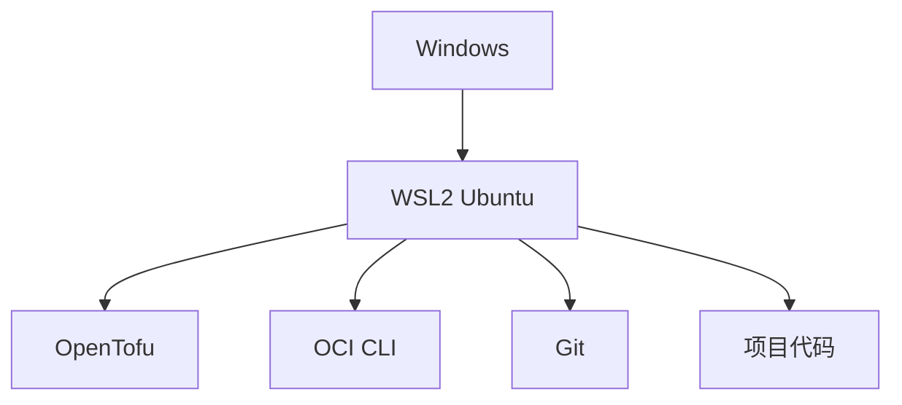

# 推荐的 Windows 开发环境

在真正安装和认证之前，先把开发环境搭对，避免后续踩坑。

## 核心要点

* 推荐结构：Windows 下的 WSL2 Ubuntu 中安装 OpenTofu、OCI CLI、Git、VS Code Remote-WSL
* 应避免 Windows 中运行 OpenTofu 但私钥和配置放在 WSL 的混合方式，容易遇到路径、权限和换行符问题
* 推荐把项目放在 WSL 原生文件系统（如 ~/projects/...），而不是 /mnt/c/Users/...
* WSL 原生 Linux 文件系统在权限管理和工具兼容方面更稳定

---

## 本章测验

本章共 5 道单项选择题。

### 第 1 题

文中推荐的开发环境结构是什么？

- A. 在 Windows 原生环境直接运行 OpenTofu
- B. 在 WSL2 Ubuntu 中统一安装 OpenTofu、OCI CLI、Git 等工具
- C. 在虚拟机中安装 macOS
- D. 只使用浏览器操作 OCI Console

选择答案后查看结果

正确答案：B

答案解析：文中推荐 Windows 下的 WSL2 Ubuntu 中安装 OpenTofu、OCI CLI、Git、VS Code Remote-WSL 以及项目代码。

### 第 2 题

文中提到应尽量避免出现的情况是？

- A. 在 WSL2 中安装 OpenTofu
- B. 使用 VS Code Remote-WSL
- C. Windows 中运行 OpenTofu 但私钥和配置放在 WSL
- D. 把项目放在 WSL 原生文件系统

选择答案后查看结果

正确答案：C

答案解析：文中明确指出应尽量避免“Windows 中运行 OpenTofu 但私钥和配置放在 WSL”这种混合方式，否则容易遇到路径、文件权限和换行符问题。

### 第 3 题

推荐把项目代码放在哪个路径？

- A. /mnt/c/Users/...
- B. C:\Users\...\Desktop
- C. 云端网盘同步目录
- D. ~/projects/opentofu-oci-learning（WSL 原生文件系统）

选择答案后查看结果

正确答案：D

答案解析：文中建议把整个项目放在 WSL 原生 Linux 文件系统下（如 ~/projects/opentofu-oci-learning），而不是 /mnt/c/Users/... 这样的 Windows 挂载路径。

### 第 4 题

为什么推荐使用 WSL 原生文件系统而不是 /mnt/c/ 路径？

- A. WSL 原生文件系统在权限管理和工具兼容方面更稳定
- B. 因为 /mnt/c/ 路径无法访问
- C. 因为 Windows 路径不支持中文
- D. 因为 /mnt/c/ 路径不能连接网络

选择答案后查看结果

正确答案：A

答案解析：文中说明 WSL 原生 Linux 文件系统在权限管理和工具兼容方面更稳定，这是推荐使用它而非 Windows 挂载路径的原因。

### 第 5 题

下列哪个工具没有出现在文中推荐的 WSL2 开发环境清单中？

- A. OpenTofu
- B. Photoshop
- C. OCI CLI
- D. VS Code Remote-WSL

选择答案后查看结果

正确答案：B

答案解析：文中列出的清单是 OpenTofu、OCI CLI、Git、VS Code Remote-WSL 和项目代码，并未提到 Photoshop。

<!-- QUIZ_DATA_START
{
  "chapter": "06",
  "questions": [
    {
      "id": 1,
      "question": "文中推荐的开发环境结构是什么？",
      "options": {
        "B": "在 WSL2 Ubuntu 中统一安装 OpenTofu、OCI CLI、Git 等工具",
        "A": "在 Windows 原生环境直接运行 OpenTofu",
        "C": "在虚拟机中安装 macOS",
        "D": "只使用浏览器操作 OCI Console"
      },
      "answer": "B",
      "explanation": "文中推荐 Windows 下的 WSL2 Ubuntu 中安装 OpenTofu、OCI CLI、Git、VS Code Remote-WSL 以及项目代码。"
    },
    {
      "id": 2,
      "question": "文中提到应尽量避免出现的情况是？",
      "options": {
        "C": "Windows 中运行 OpenTofu 但私钥和配置放在 WSL",
        "A": "在 WSL2 中安装 OpenTofu",
        "B": "使用 VS Code Remote-WSL",
        "D": "把项目放在 WSL 原生文件系统"
      },
      "answer": "C",
      "explanation": "文中明确指出应尽量避免“Windows 中运行 OpenTofu 但私钥和配置放在 WSL”这种混合方式，否则容易遇到路径、文件权限和换行符问题。"
    },
    {
      "id": 3,
      "question": "推荐把项目代码放在哪个路径？",
      "options": {
        "D": "~/projects/opentofu-oci-learning（WSL 原生文件系统）",
        "A": "/mnt/c/Users/...",
        "B": "C:\\Users\\...\\Desktop",
        "C": "云端网盘同步目录"
      },
      "answer": "D",
      "explanation": "文中建议把整个项目放在 WSL 原生 Linux 文件系统下（如 ~/projects/opentofu-oci-learning），而不是 /mnt/c/Users/... 这样的 Windows 挂载路径。"
    },
    {
      "id": 4,
      "question": "为什么推荐使用 WSL 原生文件系统而不是 /mnt/c/ 路径？",
      "options": {
        "A": "WSL 原生文件系统在权限管理和工具兼容方面更稳定",
        "B": "因为 /mnt/c/ 路径无法访问",
        "C": "因为 Windows 路径不支持中文",
        "D": "因为 /mnt/c/ 路径不能连接网络"
      },
      "answer": "A",
      "explanation": "文中说明 WSL 原生 Linux 文件系统在权限管理和工具兼容方面更稳定，这是推荐使用它而非 Windows 挂载路径的原因。"
    },
    {
      "id": 5,
      "question": "下列哪个工具没有出现在文中推荐的 WSL2 开发环境清单中？",
      "options": {
        "B": "Photoshop",
        "A": "OpenTofu",
        "C": "OCI CLI",
        "D": "VS Code Remote-WSL"
      },
      "answer": "B",
      "explanation": "文中列出的清单是 OpenTofu、OCI CLI、Git、VS Code Remote-WSL 和项目代码，并未提到 Photoshop。"
    }
  ]
}
QUIZ_DATA_END -->
