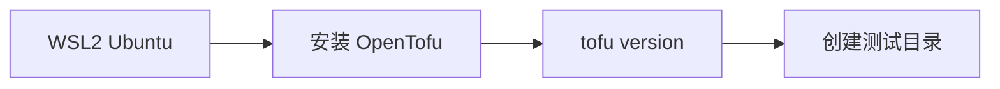

# 安装 OpenTofu 并建立测试目录

在 WSL2 Ubuntu 中完成 OpenTofu 的安装验证，并准备第一个项目目录。

## 核心要点

* 安装完成后应执行 tofu version 检查，正常会显示类似 OpenTofu v1.12.0 on linux_amd64
* 文中截至 2026 年 8 月 2 日，OpenTofu 官网显示当前版本为 1.12.0
* 建立测试目录：mkdir -p ~/projects/opentofu-oci-learning 并 cd 进入
* OpenTofu 与 Terraform 的核心配置语法和主要工作流高度兼容

---

## 本章测验

本章共 5 道单项选择题。

### 第 1 题

安装完成后，应该用什么命令验证 OpenTofu 是否安装成功？

- A. tofu check
- B. tofu status
- C. tofu version
- D. tofu verify

选择答案后查看结果

正确答案：C

答案解析：文中说明安装完成后检查应执行 tofu version，正常会看到类似 OpenTofu v1.12.0 on linux_amd64 的输出。

### 第 2 题

文中提到截至 2026 年 8 月 2 日，OpenTofu 官网显示的当前版本是？

- A. 1.6.0
- B. 2.0.0
- C. 8.24.0
- D. 1.12.0

选择答案后查看结果

正确答案：D

答案解析：文中明确写出截至该日期 OpenTofu 官网显示当前版本为 1.12.0；8.24.0 是 OCI Provider 的版本，不要混淆。

### 第 3 题

OpenTofu 与 Terraform 的关系是？

- A. 核心配置语法和主要工作流高度兼容
- B. 完全无关的两套语法
- C. OpenTofu 是 Terraform 的付费版本
- D. OpenTofu 只能管理 AWS，不能管理 OCI

选择答案后查看结果

正确答案：A

答案解析：文中指出 OpenTofu 与 Terraform 的核心配置语法和主要工作流高度兼容，OCI Provider 也可以由 OpenTofu 直接使用。

### 第 4 题

建立测试目录时使用的命令是？

- A. touch opentofu.tf
- B. mkdir -p ~/projects/opentofu-oci-learning
- C. tofu new project
- D. git init opentofu

选择答案后查看结果

正确答案：B

答案解析：文中给出的命令是 mkdir -p ~/projects/opentofu-oci-learning，然后 cd 进入该目录准备编写配置。

### 第 5 题

下列哪一项不是安装 OpenTofu 之后的建议操作？

- A. 检查版本
- B. 创建测试目录
- C. 直接在生产 Compartment 创建大量收费资源
- D. 进入项目目录准备编写配置

选择答案后查看结果

正确答案：C

答案解析：文中后续章节强调“先不创建收费资源，只查询账户信息”，安装完成后应先验证版本、建立测试目录，而不是立刻创建大量收费资源。

<!-- QUIZ_DATA_START
{
  "chapter": "07",
  "questions": [
    {
      "id": 1,
      "question": "安装完成后，应该用什么命令验证 OpenTofu 是否安装成功？",
      "options": {
        "C": "tofu version",
        "A": "tofu check",
        "B": "tofu status",
        "D": "tofu verify"
      },
      "answer": "C",
      "explanation": "文中说明安装完成后检查应执行 tofu version，正常会看到类似 OpenTofu v1.12.0 on linux_amd64 的输出。"
    },
    {
      "id": 2,
      "question": "文中提到截至 2026 年 8 月 2 日，OpenTofu 官网显示的当前版本是？",
      "options": {
        "D": "1.12.0",
        "A": "1.6.0",
        "B": "2.0.0",
        "C": "8.24.0"
      },
      "answer": "D",
      "explanation": "文中明确写出截至该日期 OpenTofu 官网显示当前版本为 1.12.0；8.24.0 是 OCI Provider 的版本，不要混淆。"
    },
    {
      "id": 3,
      "question": "OpenTofu 与 Terraform 的关系是？",
      "options": {
        "A": "核心配置语法和主要工作流高度兼容",
        "B": "完全无关的两套语法",
        "C": "OpenTofu 是 Terraform 的付费版本",
        "D": "OpenTofu 只能管理 AWS，不能管理 OCI"
      },
      "answer": "A",
      "explanation": "文中指出 OpenTofu 与 Terraform 的核心配置语法和主要工作流高度兼容，OCI Provider 也可以由 OpenTofu 直接使用。"
    },
    {
      "id": 4,
      "question": "建立测试目录时使用的命令是？",
      "options": {
        "B": "mkdir -p ~/projects/opentofu-oci-learning",
        "A": "touch opentofu.tf",
        "C": "tofu new project",
        "D": "git init opentofu"
      },
      "answer": "B",
      "explanation": "文中给出的命令是 mkdir -p ~/projects/opentofu-oci-learning，然后 cd 进入该目录准备编写配置。"
    },
    {
      "id": 5,
      "question": "下列哪一项不是安装 OpenTofu 之后的建议操作？",
      "options": {
        "C": "直接在生产 Compartment 创建大量收费资源",
        "A": "检查版本",
        "B": "创建测试目录",
        "D": "进入项目目录准备编写配置"
      },
      "answer": "C",
      "explanation": "文中后续章节强调“先不创建收费资源，只查询账户信息”，安装完成后应先验证版本、建立测试目录，而不是立刻创建大量收费资源。"
    }
  ]
}
QUIZ_DATA_END -->
