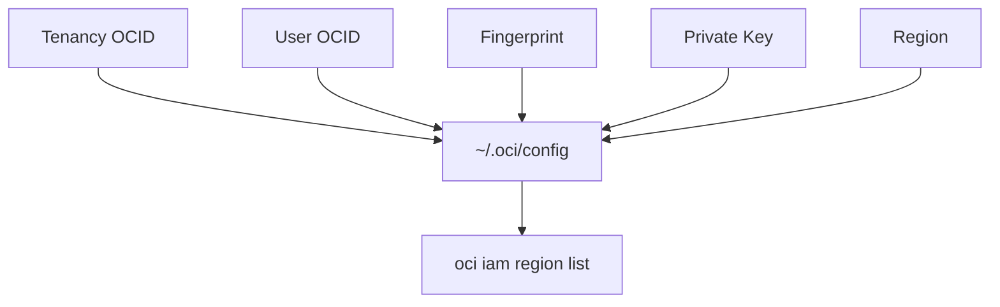

# 准备 OCI 认证信息：API Key 方式

本地 OpenTofu 最常用的认证方式是 API Key，需要准备五项关键信息。

## 核心要点

* 本地 OpenTofu 最常用的是 API Key 认证，官方 OCI Terraform 入门文档也采用这种方式
* 需要五项信息：Tenancy OCID、User OCID、Fingerprint、Private Key、Region
* 私钥可以在 OCI Console 生成，也可以用 openssl genrsa 自行生成后上传公钥
* 配置文件 ~/.oci/config 需要设置 chmod 600 权限，并用 oci iam region list 验证认证是否成功

---

## 本章测验

本章共 5 道单项选择题。

### 第 1 题

本地 OpenTofu 最常用的 OCI 认证方式是？

- A. 用户名密码登录
- B. 短信验证码
- C. 匿名访问
- D. API Key 认证

选择答案后查看结果

正确答案：D

答案解析：文中说明本地 OpenTofu 最常用的是 API Key 认证，Oracle 官方 OCI Terraform 入门文档也采用这种配置方式。

### 第 2 题

下列哪一项不是准备 API Key 认证时需要的五项信息之一？

- A. 信用卡号
- B. Tenancy OCID
- C. Fingerprint
- D. Region

选择答案后查看结果

正确答案：A

答案解析：需要准备的五项信息是 Tenancy OCID、User OCID、Fingerprint、Private Key、Region，不包含信用卡号等支付信息。

### 第 3 题

生成 API Key 私钥后，应该对私钥文件设置怎样的权限？

- A. chmod 777
- B. chmod 600
- C. 不需要设置权限
- D. chmod 444

选择答案后查看结果

正确答案：B

答案解析：文中给出的命令是 chmod 600 ~/.oci/oci_api_key.pem，用于限制私钥文件的访问权限。

### 第 4 题

配置好 ~/.oci/config 后，应该用什么命令验证认证是否成功？

- A. tofu apply
- B. tofu plan
- C. oci iam region list
- D. ssh test

选择答案后查看结果

正确答案：C

答案解析：文中说明使用 OCI CLI 执行 oci iam region list 验证，认证成功后会返回 Region 列表。

### 第 5 题

Fingerprint 是在哪个步骤中生成并显示的？

- A. 创建 VCN 时
- B. 安装 OpenTofu 时自动生成
- C. 执行 tofu destroy 时显示
- D. 将公钥添加到 OCI 用户的 API Keys 后由 OCI 显示

选择答案后查看结果

正确答案：D

答案解析：文中说明将公钥添加到 OCI 用户的 API Keys 中之后，OCI 会显示 Fingerprint，例如 12:34:56:78:90:ab:cd:ef:...

<!-- QUIZ_DATA_START
{
  "chapter": "08",
  "questions": [
    {
      "id": 1,
      "question": "本地 OpenTofu 最常用的 OCI 认证方式是？",
      "options": {
        "D": "API Key 认证",
        "A": "用户名密码登录",
        "B": "短信验证码",
        "C": "匿名访问"
      },
      "answer": "D",
      "explanation": "文中说明本地 OpenTofu 最常用的是 API Key 认证，Oracle 官方 OCI Terraform 入门文档也采用这种配置方式。"
    },
    {
      "id": 2,
      "question": "下列哪一项不是准备 API Key 认证时需要的五项信息之一？",
      "options": {
        "A": "信用卡号",
        "B": "Tenancy OCID",
        "C": "Fingerprint",
        "D": "Region"
      },
      "answer": "A",
      "explanation": "需要准备的五项信息是 Tenancy OCID、User OCID、Fingerprint、Private Key、Region，不包含信用卡号等支付信息。"
    },
    {
      "id": 3,
      "question": "生成 API Key 私钥后，应该对私钥文件设置怎样的权限？",
      "options": {
        "B": "chmod 600",
        "A": "chmod 777",
        "C": "不需要设置权限",
        "D": "chmod 444"
      },
      "answer": "B",
      "explanation": "文中给出的命令是 chmod 600 ~/.oci/oci_api_key.pem，用于限制私钥文件的访问权限。"
    },
    {
      "id": 4,
      "question": "配置好 ~/.oci/config 后，应该用什么命令验证认证是否成功？",
      "options": {
        "C": "oci iam region list",
        "A": "tofu apply",
        "B": "tofu plan",
        "D": "ssh test"
      },
      "answer": "C",
      "explanation": "文中说明使用 OCI CLI 执行 oci iam region list 验证，认证成功后会返回 Region 列表。"
    },
    {
      "id": 5,
      "question": "Fingerprint 是在哪个步骤中生成并显示的？",
      "options": {
        "D": "将公钥添加到 OCI 用户的 API Keys 后由 OCI 显示",
        "A": "创建 VCN 时",
        "B": "安装 OpenTofu 时自动生成",
        "C": "执行 tofu destroy 时显示"
      },
      "answer": "D",
      "explanation": "文中说明将公钥添加到 OCI 用户的 API Keys 中之后，OCI 会显示 Fingerprint，例如 12:34:56:78:90:ab:cd:ef:..."
    }
  ]
}
QUIZ_DATA_END -->
