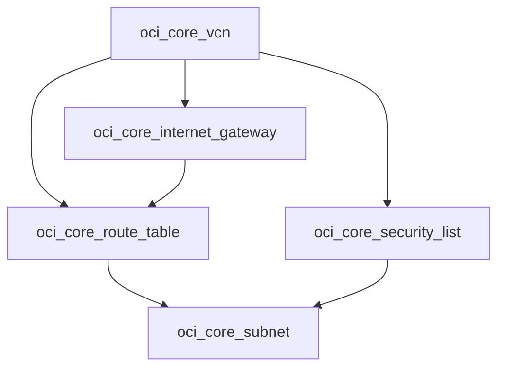

# 创建 OCI VCN 网络：依赖自动推断

从查询进阶到创建：搭建包含公有子网的完整网络，并理解 OpenTofu 如何自动推断依赖顺序。

## 核心要点

* 网络资源包括 oci_core_vcn、oci_core_internet_gateway、oci_core_route_table、oci_core_security_list、oci_core_subnet
* 没有写 depends_on，但 OpenTofu 能通过属性引用（如 vcn_id = oci_core_vcn.main.id）自动推断依赖顺序
* 推断出的创建顺序：VCN → Internet Gateway / Security List / Route Table → Public Subnet
* vcn_cidr 变量使用 validation 块配合 can(cidrnetmask(...)) 校验是否为合法 IPv4 CIDR

---

## 本章测验

本章共 5 道单项选择题。

### 第 1 题

OpenTofu 如何知道 Public Subnet 应该在 VCN 创建之后才创建？

- A. 必须手工编写 depends_on 才能实现
- B. 通过属性引用（如 vcn_id = oci_core_vcn.main.id）自动推断依赖
- C. 按照文件名字母顺序创建
- D. 随机顺序创建，不影响结果

选择答案后查看结果

正确答案：B

答案解析：文中示例没有写任何 depends_on，但因为 Subnet、Route Table 等资源都通过属性引用了 VCN 的 id，OpenTofu 能够自动推断出正确的创建顺序。

### 第 2 题

下列哪一个资源类型不属于本章创建的 OCI 网络资源？

- A. oci_core_vcn
- B. oci_core_internet_gateway
- C. oci_database_db_system
- D. oci_core_subnet

选择答案后查看结果

正确答案：C

答案解析：本章涉及的网络资源是 VCN、Internet Gateway、Route Table、Security List 和 Subnet，oci_database_db_system 是数据库资源，不属于本章内容。

### 第 3 题

根据自动推断出的依赖关系，下列创建顺序中正确的是？

- A. Public Subnet 先于 VCN 创建
- B. Route Table 先于 Internet Gateway 创建
- C. 所有资源同时创建，没有先后顺序
- D. VCN 先创建，随后是 Internet Gateway、Security List、Route Table，最后是 Public Subnet

选择答案后查看结果

正确答案：D

答案解析：因为 Route Rule 依赖 Internet Gateway，Subnet 依赖 Route Table 和 Security List，而这些又都依赖 VCN，所以最终顺序是 VCN 优先，Subnet 最后。

### 第 4 题

vcn_cidr 变量中的 validation 块使用了什么函数来校验 CIDR 合法性？

- A. can(cidrnetmask(var.vcn_cidr))
- B. cidrhost
- C. regexall
- D. length

选择答案后查看结果

正确答案：A

答案解析：文中示例使用 condition = can(cidrnetmask(var.vcn_cidr)) 来判断输入是否为合法的 IPv4 CIDR 格式。

### 第 5 题

oci_core_security_list 中的 egress_security_rules 配置 destination = "0.0.0.0/0" 的作用是什么？

- A. 禁止所有出站流量
- B. 允许所有出站流量
- C. 只允许 SSH 出站
- D. 只允许 HTTP 出站

选择答案后查看结果

正确答案：B

答案解析：示例中的 egress 规则协议为 all、目标为 0.0.0.0/0，注释为 Allow outbound traffic，表示允许所有出站流量。

<!-- QUIZ_DATA_START
{
  "chapter": "10",
  "questions": [
    {
      "id": 1,
      "question": "OpenTofu 如何知道 Public Subnet 应该在 VCN 创建之后才创建？",
      "options": {
        "B": "通过属性引用（如 vcn_id = oci_core_vcn.main.id）自动推断依赖",
        "A": "必须手工编写 depends_on 才能实现",
        "C": "按照文件名字母顺序创建",
        "D": "随机顺序创建，不影响结果"
      },
      "answer": "B",
      "explanation": "文中示例没有写任何 depends_on，但因为 Subnet、Route Table 等资源都通过属性引用了 VCN 的 id，OpenTofu 能够自动推断出正确的创建顺序。"
    },
    {
      "id": 2,
      "question": "下列哪一个资源类型不属于本章创建的 OCI 网络资源？",
      "options": {
        "C": "oci_database_db_system",
        "A": "oci_core_vcn",
        "B": "oci_core_internet_gateway",
        "D": "oci_core_subnet"
      },
      "answer": "C",
      "explanation": "本章涉及的网络资源是 VCN、Internet Gateway、Route Table、Security List 和 Subnet，oci_database_db_system 是数据库资源，不属于本章内容。"
    },
    {
      "id": 3,
      "question": "根据自动推断出的依赖关系，下列创建顺序中正确的是？",
      "options": {
        "D": "VCN 先创建，随后是 Internet Gateway、Security List、Route Table，最后是 Public Subnet",
        "A": "Public Subnet 先于 VCN 创建",
        "B": "Route Table 先于 Internet Gateway 创建",
        "C": "所有资源同时创建，没有先后顺序"
      },
      "answer": "D",
      "explanation": "因为 Route Rule 依赖 Internet Gateway，Subnet 依赖 Route Table 和 Security List，而这些又都依赖 VCN，所以最终顺序是 VCN 优先，Subnet 最后。"
    },
    {
      "id": 4,
      "question": "vcn_cidr 变量中的 validation 块使用了什么函数来校验 CIDR 合法性？",
      "options": {
        "A": "can(cidrnetmask(var.vcn_cidr))",
        "B": "cidrhost",
        "C": "regexall",
        "D": "length"
      },
      "answer": "A",
      "explanation": "文中示例使用 condition = can(cidrnetmask(var.vcn_cidr)) 来判断输入是否为合法的 IPv4 CIDR 格式。"
    },
    {
      "id": 5,
      "question": "oci_core_security_list 中的 egress_security_rules 配置 destination = \"0.0.0.0/0\" 的作用是什么？",
      "options": {
        "B": "允许所有出站流量",
        "A": "禁止所有出站流量",
        "C": "只允许 SSH 出站",
        "D": "只允许 HTTP 出站"
      },
      "answer": "B",
      "explanation": "示例中的 egress 规则协议为 all、目标为 0.0.0.0/0，注释为 Allow outbound traffic，表示允许所有出站流量。"
    }
  ]
}
QUIZ_DATA_END -->
