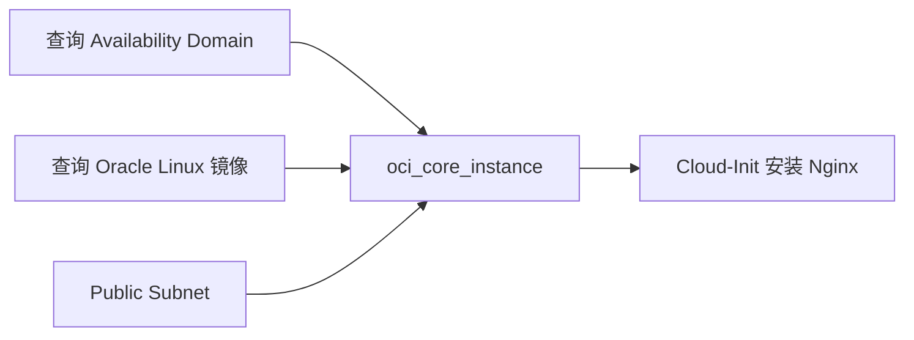

# 创建 OCI Compute 实例：镜像与 Cloud-Init

在已经建好的网络上创建一台真正运行 Nginx 的虚拟机。

## 核心要点

* 创建 Compute 需要 Availability Domain、Subnet OCID、Image OCID、Shape、SSH Public Key
* 不要把固定 Image OCID 直接复制到所有 Region，因为镜像 OCID 通常具有区域性
* 可以用 data.oci_core_images 按 sort_by TIMECREATED / sort_order DESC 查询最新镜像
* Flexible Shape（如 VM.Standard.E5.Flex）需要额外配置 shape_config 的 ocpus 和 memory_in_gbs

---

## 本章测验

本章共 5 道单项选择题。

### 第 1 题

创建 OCI Compute 实例时，下列哪一项不是必须准备的信息？

- A. Availability Domain
- B. Image OCID
- C. 数据库连接字符串
- D. SSH Public Key

选择答案后查看结果

正确答案：C

答案解析：创建 Compute 需要 Availability Domain、Subnet OCID、Image OCID、Shape、SSH Public Key，数据库连接字符串与创建 Compute 实例无关。

### 第 2 题

为什么不建议把固定 Image OCID 直接复制到所有 Region 使用？

- A. 因为固定 OCID 会导致费用增加
- B. 因为 OCID 长度不够
- C. 因为不同 Region 不允许使用 Oracle Linux
- D. 因为镜像 OCID 通常具有区域性

选择答案后查看结果

正确答案：D

答案解析：文中特别提醒镜像 OCID 通常具有区域性，跨 Region 直接复用固定 OCID 可能会找不到对应资源。

### 第 3 题

查询最新 Oracle Linux 镜像时，data.oci_core_images 使用了怎样的排序方式？

- A. sort_by TIMECREATED，sort_order DESC
- B. 按名称字母顺序
- C. 按 OCID 数值大小
- D. 不排序，随机返回

选择答案后查看结果

正确答案：A

答案解析：示例中使用 sort_by = "TIMECREATED" 和 sort_order = "DESC"，从而取 images[0] 得到最新的镜像。

### 第 4 题

如果使用 Flexible Shape（如 VM.Standard.E5.Flex），还需要额外配置什么？

- A. 只需要 Shape 名称即可，无需其他配置
- B. shape_config 中的 ocpus 和 memory_in_gbs
- C. 必须单独申请配额审批表
- D. 必须使用固定 IP

选择答案后查看结果

正确答案：B

答案解析：文中说明使用 Flexible Shape 时需要配置 shape_config 块，指定 ocpus 数量和 memory_in_gbs 内存大小。

### 第 5 题

示例中的 Cloud-Init 脚本主要完成了什么操作？

- A. 安装数据库并导入数据
- B. 配置 Kubernetes 集群
- C. 安装 nginx 并启动服务，写入一个简单首页
- D. 创建新的 VCN

选择答案后查看结果

正确答案：C

答案解析：metadata 中的 user_data 是一段 cloud-config，安装 nginx 包，并通过 runcmd 启用、启动服务，同时写入一行 HTML 作为首页内容。

<!-- QUIZ_DATA_START
{
  "chapter": "11",
  "questions": [
    {
      "id": 1,
      "question": "创建 OCI Compute 实例时，下列哪一项不是必须准备的信息？",
      "options": {
        "C": "数据库连接字符串",
        "A": "Availability Domain",
        "B": "Image OCID",
        "D": "SSH Public Key"
      },
      "answer": "C",
      "explanation": "创建 Compute 需要 Availability Domain、Subnet OCID、Image OCID、Shape、SSH Public Key，数据库连接字符串与创建 Compute 实例无关。"
    },
    {
      "id": 2,
      "question": "为什么不建议把固定 Image OCID 直接复制到所有 Region 使用？",
      "options": {
        "D": "因为镜像 OCID 通常具有区域性",
        "A": "因为固定 OCID 会导致费用增加",
        "B": "因为 OCID 长度不够",
        "C": "因为不同 Region 不允许使用 Oracle Linux"
      },
      "answer": "D",
      "explanation": "文中特别提醒镜像 OCID 通常具有区域性，跨 Region 直接复用固定 OCID 可能会找不到对应资源。"
    },
    {
      "id": 3,
      "question": "查询最新 Oracle Linux 镜像时，data.oci_core_images 使用了怎样的排序方式？",
      "options": {
        "A": "sort_by TIMECREATED，sort_order DESC",
        "B": "按名称字母顺序",
        "C": "按 OCID 数值大小",
        "D": "不排序，随机返回"
      },
      "answer": "A",
      "explanation": "示例中使用 sort_by = \"TIMECREATED\" 和 sort_order = \"DESC\"，从而取 images[0] 得到最新的镜像。"
    },
    {
      "id": 4,
      "question": "如果使用 Flexible Shape（如 VM.Standard.E5.Flex），还需要额外配置什么？",
      "options": {
        "B": "shape_config 中的 ocpus 和 memory_in_gbs",
        "A": "只需要 Shape 名称即可，无需其他配置",
        "C": "必须单独申请配额审批表",
        "D": "必须使用固定 IP"
      },
      "answer": "B",
      "explanation": "文中说明使用 Flexible Shape 时需要配置 shape_config 块，指定 ocpus 数量和 memory_in_gbs 内存大小。"
    },
    {
      "id": 5,
      "question": "示例中的 Cloud-Init 脚本主要完成了什么操作？",
      "options": {
        "C": "安装 nginx 并启动服务，写入一个简单首页",
        "A": "安装数据库并导入数据",
        "B": "配置 Kubernetes 集群",
        "D": "创建新的 VCN"
      },
      "answer": "C",
      "explanation": "metadata 中的 user_data 是一段 cloud-config，安装 nginx 包，并通过 runcmd 启用、启动服务，同时写入一行 HTML 作为首页内容。"
    }
  ]
}
QUIZ_DATA_END -->
